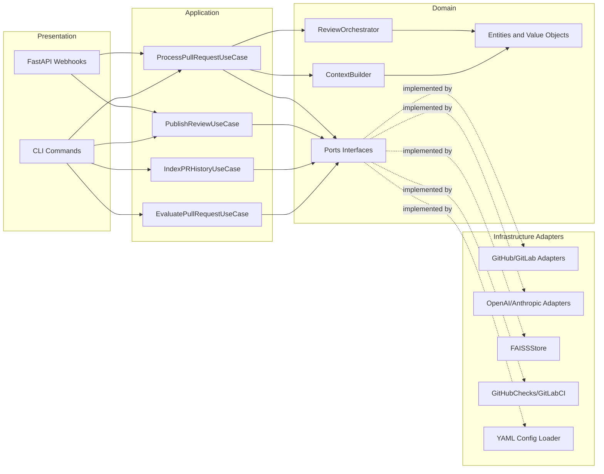
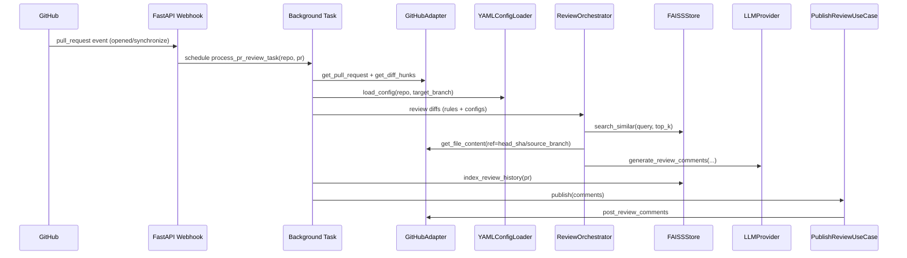
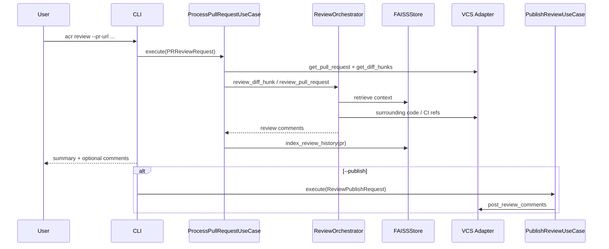
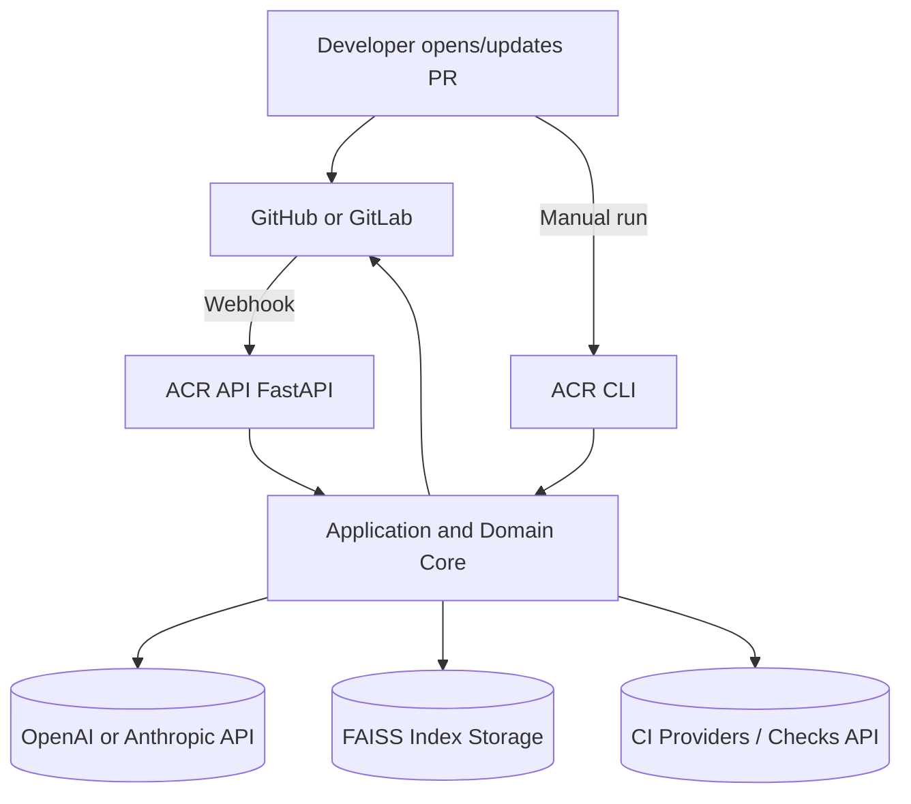

# Architektura ogolna systemu ACR

## 1. Cel podrozdzialu

Celem podrozdzialu jest przedstawienie architektury ogolnej systemu ACR jako rozwiazania typu end-to-end do automatycznego wspomagania Code Review w workflow PR/MR.

Opis obejmuje:

- podzial odpowiedzialnosci na warstwy,
- granice heksagonalne (porty i adaptery),
- glowne przeplywy wykonawcze (API webhook oraz CLI),
- mechanizmy rozszerzalnosci i miejsca sprzegania z systemami zewnetrznymi.

## 2. Styl architektoniczny i zalozenia

System zostal zaprojektowany jako polaczenie:

1. Clean Architecture (separacja logiki biznesowej od infrastruktury),
2. Hexagonal Architecture / Ports and Adapters (jawne kontrakty dla integracji),
3. orchestracji use-case centrycznej (warstwa application jako koordynator przeplywu).

Najwazniejsze zalozenia architektoniczne:

- logika domenowa pozostaje niezalezna od API VCS, dostawcow LLM i implementacji RAG,
- zaleznosci implementacyjne sa skierowane do wewnatrz (infrastructure -> domain ports),
- zmiana dostawcy (np. GitHub/GitLab, OpenAI/Anthropic) nie wymaga zmian modelu domenowego,
- system moze dzialac zarowno reaktywnie (webhook), jak i wsadowo/manualnie (CLI).

## 3. Widok warstwowy

## 3.1. Warstwa prezentacji

Odpowiada za wejscie do systemu:

- API FastAPI (webhooki),
- CLI (uruchomienia manualne i eksperymentalne).

Warstwa nie implementuje logiki review; deleguje do use-case'ow.

## 3.2. Warstwa aplikacji

Odpowiada za orkiestracje scenariuszy:

- przetworzenie PR/MR,
- publikacja komentarzy,
- indeksacja historii PR,
- ewaluacja eksperymentalna.

To tutaj spinane sa porty domenowe i serwisy domenowe.

## 3.3. Warstwa domenowa

Zawiera:

- encje (np. PullRequest, DiffHunk, ReviewComment, CodeContext),
- value objects (np. Severity, FilePath, LLMConfig, RAGConfig),
- porty (VCSRepository, LLMProvider, EmbeddingStore, StaticAnalyzer, ConfigRepository, CallGraphAnalyzer, ImpactAnalyzer),
- serwisy domenowe (ContextBuilder, ReviewOrchestrator).

Warstwa domenowa definiuje reguly i kontrakty, bez zaleznosci od konkretnej technologii integracyjnej.

## 3.4. Warstwa infrastruktury

Implementuje adaptery do systemow zewnetrznych:

- VCS: GitHubAdapter, GitLabAdapter,
- CI: GitHubChecksAdapter, GitLabCIAdapter,
- LLM: OpenAIAdapter, AnthropicAdapter + LLMProviderFactory,
- RAG: FAISSStore,
- konfiguracja: YAMLConfigLoader.

## 3.5. Warstwa wspolna

Elementy przekrojowe:

- logowanie,
- wyjatki infrastrukturalne,
- narzedzia pomocnicze (np. telemetry/token usage).

## 4. Diagram architektury logicznej (warstwy + porty)

## 5. Granice heksagonalne: porty i adaptery

Kluczowa decyzja architektoniczna polega na tym, ze warstwa domenowa komunikuje sie ze swiatem zewnetrznym wylacznie przez porty.

Przykladowe mapowanie:

- port VCSRepository -> GitHubAdapter / GitLabAdapter,
- port LLMProvider -> OpenAIAdapter / AnthropicAdapter,
- port EmbeddingStore -> FAISSStore,
- port StaticAnalyzer -> GitHubChecksAdapter / GitLabCIAdapter,
- port ConfigRepository -> YAMLConfigLoader (repo) lub FileYAMLConfigLoader (lokalna ewaluacja).

Konsekwencja: system utrzymuje niskie sprzezenie miedzy logika review a API zewnetrznymi.

## 6. Komponent centralny: ReviewOrchestrator

ReviewOrchestrator jest domenowym punktem koordynacji review i wykonuje m.in.:

1. pobranie kontekstu przez ContextBuilder (RAG + surrounding code + historia PR),
2. pobranie i parsowanie sygnalow CI (jesli wlaczono analyzer),
3. wywolanie LLM dla hunkow diff,
4. opcjonalna analize impactu (breaking changes) przez call graph + impact analyzer,
5. agregacje komentarzy.

To podejscie oddziela decyzje domenowe od szczegolow transportu danych.

## 7. Przeplyw glowny: scenariusz webhook (GitHub)

Scenariusz runtime dla pull_request opened/synchronize:

1. Webhook API odbiera event i planuje background task.
2. Task buduje graph zaleznosci (adaptery + serwisy + use-case).
3. ProcessPullRequestUseCase pobiera PR i diff.
4. Ladowana jest konfiguracja .acr-config.yml z repo.
5. Dla plikow/hunkow uruchamiana jest analiza z kontekstem RAG i sygnalami CI.
6. Wynik review jest indeksowany do historii (RAG memory).
7. PublishReviewUseCase publikuje komentarze do PR.

Diagram sekwencji:

## 8. Przeplyw alternatywny: scenariusz CLI

CLI realizuje ten sam rdzen domenowy co API, ale daje dodatkowe tryby:

- review manualny PR/MR,
- index-history (budowa bazy wiedzy z merged PR),
- evaluate (scenariusz eksperymentalny: index + review + raport JSON).

Diagram sekwencji:

## 9. Konfiguracja i polityki jako element architektury

Konfiguracja .acr-config.yml jest traktowana jako runtime policy:

- aktywacja/dezaktywacja review,
- globalne i per-file rule sets,
- konfiguracja LLM i RAG (global + override per pattern),
- polityka publikacji komentarzy (min_severity, wykluczenia, filtry).

To oznacza, ze czesc decyzji architektonicznych jest przeniesiona do warstwy konfiguracyjnej, bez modyfikacji kodu.

## 10. RAG jako podsystem architektoniczny

FAISSStore realizuje dwa cele:

1. retrieval kontekstu dla biezacego review,
2. inkrementalna pamiec organizacyjna przez index_review_history.

Indeksowane sa m.in.:

- dokumenty architektoniczne,
- historia zmian i dyskusji PR,
- diff-only fallback (gdy brak dyskusji).

W praktyce tworzy to petle uczenia przez kontekst historyczny, bez retrenowania modelu LLM.

## 11. Widok wdrozeniowy (kontekst runtime)

## 12. Cechy jakosciowe architektury

Architektura wspiera kluczowe atrybuty jakosciowe:

- modifiability: wymiana adaptera bez zmian domeny,
- testability: mozliwosc testow warstwowych przez porty,
- scalability organizacyjna: osobne punkty wejscia API i CLI,
- observability: centralne logowanie + statystyki tokenow (scenariusze ewaluacyjne),
- governance: kontrola publikacji i standardow przez konfiguracje projektu.

## 13. Ograniczenia i aktualny stan implementacji

- Sciezka GitLab webhook jest zaznaczona, ale bez pelnej analogicznej orkiestracji jak GitHub background flow.
- Publikacja inline na GitLab jest uproszczona (MR notes zamiast pelnego pozycjonowania).
- Jakosc review pozostaje zalezna od jakosci dostarczonego kontekstu i konfiguracji regul.

## 14. Wniosek pod podrozdzial

Architektura ogolna systemu ACR realizuje podejscie heksagonalne z czystym podzialem odpowiedzialnosci i wspolnym rdzeniem domenowym dla API oraz CLI. Dzieki portom i adapterom system laczy integracje VCS, LLM, CI i RAG w jednolity przeplyw review, przy zachowaniu mozliwosci ewolucji technologicznej oraz kontroli polityk projektowych na poziomie konfiguracji.

## 15. Material zrodlowy wykorzystany do opracowania

- [README.md](README.md)
- [architektura-systemu.md](architektura-systemu.md)
- [acr_system/presentation/api/main.py](acr_system/presentation/api/main.py)
- [acr_system/presentation/api/webhook_handlers.py](acr_system/presentation/api/webhook_handlers.py)
- [acr_system/presentation/cli/main.py](acr_system/presentation/cli/main.py)
- [acr_system/application/use_cases/process_pull_request.py](acr_system/application/use_cases/process_pull_request.py)
- [acr_system/application/use_cases/publish_review.py](acr_system/application/use_cases/publish_review.py)
- [acr_system/application/use_cases/index_pr_history.py](acr_system/application/use_cases/index_pr_history.py)
- [acr_system/application/use_cases/evaluate_pull_request.py](acr_system/application/use_cases/evaluate_pull_request.py)
- [acr_system/domain/interfaces/ports.py](acr_system/domain/interfaces/ports.py)
- [acr_system/domain/services/services.py](acr_system/domain/services/services.py)
- [acr_system/infrastructure/llm/llm_factory.py](acr_system/infrastructure/llm/llm_factory.py)
- [acr_system/infrastructure/config/project_config.py](acr_system/infrastructure/config/project_config.py)
- [acr_system/infrastructure/config/yaml_config_loader.py](acr_system/infrastructure/config/yaml_config_loader.py)
- [acr_system/infrastructure/vcs/github_adapter.py](acr_system/infrastructure/vcs/github_adapter.py)
- [acr_system/infrastructure/vcs/gitlab_adapter.py](acr_system/infrastructure/vcs/gitlab_adapter.py)
- [acr_system/infrastructure/ci/github_checks_adapter.py](acr_system/infrastructure/ci/github_checks_adapter.py)
- [acr_system/infrastructure/rag/faiss_store.py](acr_system/infrastructure/rag/faiss_store.py)
