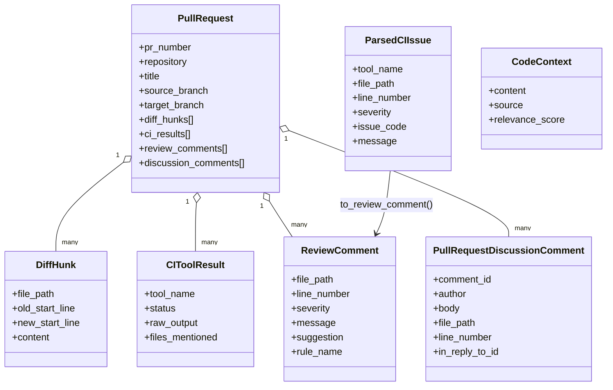
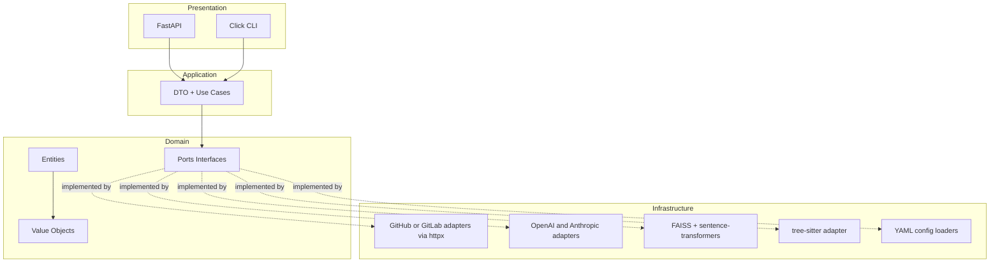

# Model danych i wybor technologii

## 1. Cel podrozdzialu

Celem podrozdzialu jest przedstawienie:

- modelu danych systemu ACR,
- relacji miedzy obiektami domenowymi i transportowymi,
- uzasadnienia wyboru technologii w kontekscie wymagan funkcjonalnych i niefunkcjonalnych.

Opis bazuje na implementacji aktualnie obecnej w repozytorium.

## 2. Perspektywa modelu danych

Model danych systemu ma charakter warstwowy:

1. model domenowy: encje i value objects opisujace semantyke review,
2. model aplikacyjny: DTO sterujace przeplywem use case,
3. model infrastrukturalny: reprezentacje zewnetrzne (API VCS, CI, index RAG).

Kluczowa decyzja projektowa: semantyka biznesowa jest utrzymywana w domenie, a formaty zewnatrzne sa translacjami adapterow.

## 3. Model domenowy

## 3.1. Encje podstawowe

Najwazniejsze encje:

- PullRequest: agregat procesu review,
- DiffHunk: atom zmiany kodu,
- ReviewComment: wynik recenzji,
- ParsedCIIssue i CIToolResult: dane CI przed i po normalizacji,
- CodeContext: kontekst dostarczany do inferencji,
- PullRequestDiscussionComment: historia dyskusji do RAG,
- FunctionNode: reprezentacja funkcji dla AST i impact analysis,
- ArchitecturalDocument: dokumenty wiedzy projektowej.

## 3.2. Value Objects

Model VO stabilizuje typy i walidacje:

- FilePath,
- Language,
- Severity,
- CommentSource,
- RuleSet,
- FilePatternRule,
- LLMConfig,
- RAGConfig,
- ImpactAnalysisConfig,
- CallSite,
- ImportSite,
- BreakingChange,
- ImpactAnalysisResult.

Walidacje sa wykonywane na poziomie konstruktorow, co ogranicza propagacje danych niespojnych.

## 3.3. Inwarianty danych

Przyklady inwariantow wymuszanych przez model:

- DiffHunk wymaga niepustego content i nieujemnych zakresow linii,
- ReviewComment wymaga niepustego message i dodatniej line_number,
- Severity przyjmuje tylko error/warning/info,
- RAGConfig wymaga top_k > 0,
- ImpactAnalysisResult wymaga niepustego function_name i summary.

## 4. Relacje miedzy obiektami

PullRequest jest agregatem centralnym i zawiera kolekcje:

- diff_hunks,
- ci_results,
- review_comments,
- discussion_comments.

To pozwala utrzymac spojnosc procesu review w jednym kontekscie transakcyjnym use case.

Diagram relacji danych:

## 5. Model aplikacyjny (DTO)

Warstwa aplikacji korzysta z lekkich DTO:

- PRReviewRequest,
- ReviewResult,
- ContextRetrievalRequest,
- ReviewPublishRequest,
- PRHistoryIndexRequest,
- PRHistoryIndexResult.

Ich rola:

- oddzielenie kontraktow use case od encji domenowych,
- uproszczenie wejsc/wyjsc dla API i CLI,
- czytelne granice serializacji i raportowania.

## 6. Model danych konfiguracji

Konfiguracja per repozytorium jest reprezentowana przez ProjectConfig i zawiera:

- global_rules,
- file_patterns,
- llm_config,
- rag_config,
- impact_analysis_config,
- publish_config.

Mechanizm get_rules_for_file buduje finalny kontekst wykonawczy per plik:

- rules_text,
- final_rag_config,
- final_llm_config.

To jest kluczowy lacznik miedzy modelem danych a polityka dzialania systemu.

## 7. Model danych kontekstu i historii

Warstwa RAG przechowuje:

- index.faiss (wektory),
- documents.json (metadane i tresc).

Elementy wiedzy historycznej maja metadata identyfikacyjna:

- source,
- repo,
- pr_number,
- comment_id,
- unique_key.

Pozwala to laczyc retrieval semantyczny z filtrowaniem po kontekscie repozytoryjnym.

## 8. Kryteria wyboru technologii

Dobor technologii oparto o kryteria:

1. zgodnosc z architektura heksagonalna,
2. wsparcie asynchronicznego IO,
3. dostepnosc bibliotek LLM i RAG,
4. latwosc testowania i utrzymania,
5. dojrzalosc ekosystemu Python 3.11+.

## 9. Wybor technologii warstwy runtime

## 9.1. Jezyk i platforma

- Python 3.11+

Uzasadnienie:

- dojrzale biblioteki dla LLM, RAG, API i CI,
- szybkie iteracje badawczo-projektowe,
- dobra kompatybilnosc z asynchronicznym modelem integracji.

## 9.2. API i interfejsy wejscia

- FastAPI + Uvicorn dla warstwy webhook,
- Click dla CLI.

Uzasadnienie:

- szybkie endpointy asynchroniczne,
- jasny podzial trybu serwerowego i wsadowego,
- wygodne uruchamianie scenariuszy eksperymentalnych.

## 9.3. Integracje zewnetrzne

- httpx jako klient HTTP async,
- PyJWT do GitHub App auth,
- python-dotenv do konfiguracji srodowiskowej.

Uzasadnienie:

- spojny model async end-to-end,
- bezpieczna i standardowa obsluga tokenow,
- przenoszalnosc konfiguracji miedzy srodowiskami.

## 9.4. Warstwa AI i RAG

- openai i anthropic jako providerzy LLM,
- sentence-transformers do embeddingow,
- faiss-cpu jako backend wektorowy,
- rank-bm25 jako zaleznosc wspierajaca rozszerzalnosc retrieval.

Uzasadnienie:

- mozliwosc wielomodelowosci,
- niski koszt wejscia i szybka lokalna ewaluacja dla FAISS,
- dobrze znany stos badawczy dla workflow RAG.

## 9.5. Analiza kodu

- tree-sitter do parsowania AST.

Uzasadnienie:

- multi-language parsing,
- stabilna ekstrakcja struktur kodu,
- wsparcie dla impact analysis i enrichment kontekstu.

## 9.6. Jakosc i utrzymanie

- pytest, pytest-asyncio, pytest-cov,
- black, ruff, mypy,
- pre-commit.

Uzasadnienie:

- testowalnosc warstwowa,
- kontrola jakosci kodu,
- ograniczenie regresji przy rozwoju systemu.

## 10. Mapowanie technologii na warstwy architektury

## 11. Kompromisy i ograniczenia technologiczne

1. FAISS jako lokalny backend jest prosty i szybki, ale nie rozwiazuje natywnie scenariuszy rozproszonej replikacji.
2. Wysoka elastycznosc konfiguracji YAML wymaga dyscypliny zespolowej i walidacji schema w kolejnych iteracjach.
3. Wielodostawcowosc LLM zwieksza odpornosc, ale podnosi zlozonosc testowania zgodnosci odpowiedzi.
4. Asynchroniczne integracje HTTP poprawiaja throughput, ale wymagaja ostroznej obslugi timeoutow i bledow transient.

## 12. Wniosek pod podrozdzial

Model danych systemu ACR zostal zaprojektowany jako spojna, walidowana warstwa domenowa z jasnym podzialem na encje, value objects i DTO, co upraszcza rozwoj oraz testowanie mechanizmow review. Dobor technologii wspiera ten model: Python 3.11+, FastAPI, Click, httpx, tree-sitter, OpenAI/Anthropic, sentence-transformers i FAISS tworza praktyczny stos umozliwiajacy realizacje wieloetapowego procesu ACR z RAG przy zachowaniu modifiability i operacyjnej efektywnosci.

## 13. Material zrodlowy wykorzystany do opracowania

- [pyproject.toml](pyproject.toml)
- [README.md](README.md)
- [acr_system/domain/entities/entities.py](acr_system/domain/entities/entities.py)
- [acr_system/domain/value_objects/value_objects.py](acr_system/domain/value_objects/value_objects.py)
- [acr_system/application/dto/dto.py](acr_system/application/dto/dto.py)
- [acr_system/domain/interfaces/ports.py](acr_system/domain/interfaces/ports.py)
- [acr_system/infrastructure/config/project_config.py](acr_system/infrastructure/config/project_config.py)
- [acr_system/infrastructure/config/yaml_config_loader.py](acr_system/infrastructure/config/yaml_config_loader.py)
- [acr_system/infrastructure/config/file_yaml_config_loader.py](acr_system/infrastructure/config/file_yaml_config_loader.py)
- [acr_system/infrastructure/rag/faiss_store.py](acr_system/infrastructure/rag/faiss_store.py)
- [acr_system/presentation/api/main.py](acr_system/presentation/api/main.py)
- [acr_system/ast/tree_sitter_adapter.py](acr_system/ast/tree_sitter_adapter.py)
