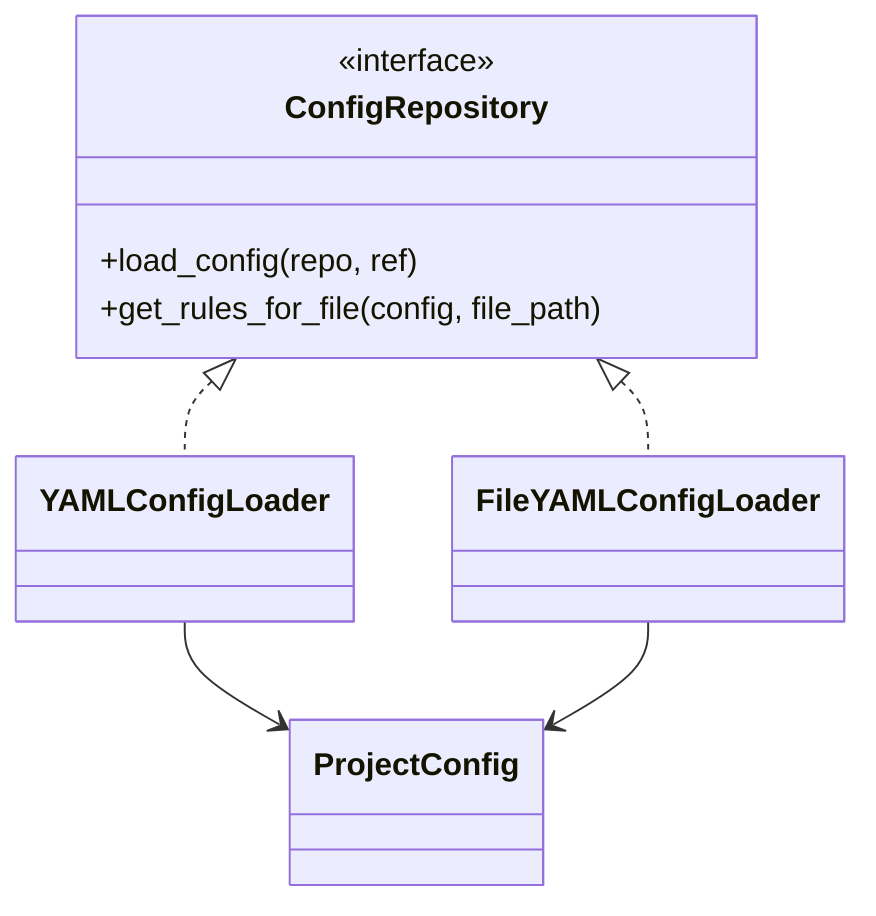
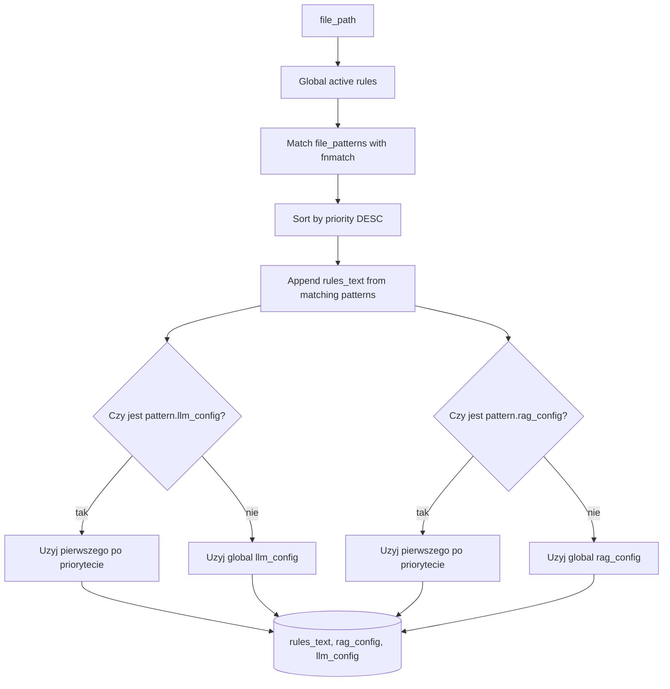
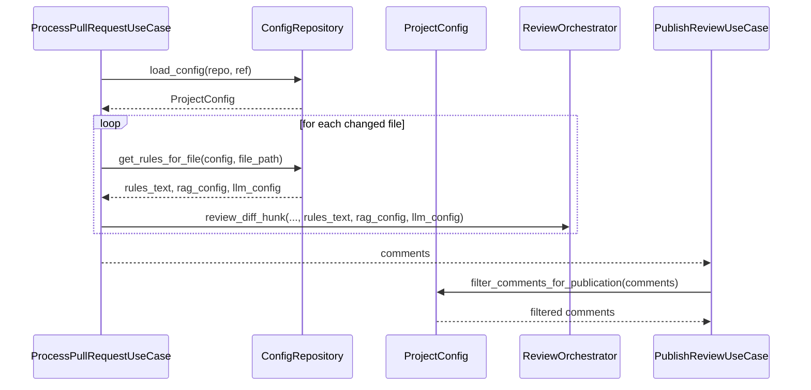

# Projekt mechanizmu konfiguracji per repozytorium

## 1. Cel podrozdzialu

Celem podrozdzialu jest przedstawienie projektu mechanizmu konfiguracji per repozytorium w systemie ACR, czyli sposobu, w jaki system:

- pobiera polityki review z konkretnego repo,
- mapuje konfiguracje na decyzje wykonawcze,
- stosuje nadpisania per typ pliku,
- egzekwuje polityke publikacji komentarzy.

Opis dotyczy implementacji obecnej w kodzie projektu.

## 2. Rola konfiguracji w architekturze systemu

Konfiguracja per repozytorium jest warstwa policyjna systemu. Nie zmienia kodu aplikacji, ale steruje jego zachowaniem runtime.

Mechanizm ten pozwala kazdemu repozytorium definiowac lokalne zasady:

1. co i jak recenzowac,
2. jakich modeli i parametrow uzywac,
3. jaki kontekst RAG pobierac,
4. ktore komentarze publikowac.

Dzieki temu ten sam rdzen aplikacji moze dzialac w wielu repozytoriach o roznych standardach.

## 3. Kontrakt domenowy i implementacje

Mechanizm opiera sie o port ConfigRepository, ktory definiuje:

- load_config(repo, ref) -> ProjectConfig,
- get_rules_for_file(config, file_path) -> (rules_text, rag_config, llm_config).

Implementacje portu:

- YAMLConfigLoader: ladowanie konfiguracji z repozytorium (
  plik .acr-config.yml),
- FileYAMLConfigLoader: ladowanie konfiguracji z lokalnego pliku (scenariusze evaluate/eksperymentalne).

Diagram kontraktu:

## 4. Model konfiguracji ProjectConfig

ProjectConfig agreguje polityki runtime dla repozytorium:

- review_enabled,
- global_rules,
- file_patterns,
- llm_config,
- rag_config,
- impact_analysis_config,
- publish_config.

Mechanizm ten scala konfiguracje funkcjonalna (review) i operacyjna (publikacja, progi, filtry) w jednym modelu.

## 5. Zrodlo konfiguracji i wersjonowanie

## 5.1. Konfiguracja repozytoryjna

YAMLConfigLoader pobiera .acr-config.yml przez VCSRepository.get_file_content(repo, file_path, ref).

Istotna cecha: konfiguracja jest ladowana dla wskazanego ref, co pozwala powiazac polityke review z wersja kodu.

## 5.2. Konfiguracja lokalna

FileYAMLConfigLoader czyta plik YAML z dysku i sluzy glownie do uruchomien eksperymentalnych (evaluate), gdzie chcemy narzucic kontrolowana konfiguracje niezaleznie od stanu repo.

## 6. Struktura semantyczna .acr-config.yml

Parser YAMLConfigLoader mapuje sekcje:

1. review:
   - wlaczenie/wylaczenie procesu review.
2. global_rules:
   - zestawy zasad obowiazujace globalnie.
3. file_patterns:
   - reguly i override per wzorzec pliku.
4. llm:
   - domyslna konfiguracja modelu.
5. rag:
   - domyslna konfiguracja retrieval.
6. impact_analysis:
   - ustawienia analizy impactu.
7. publish:
   - polityka filtrowania komentarzy przed publikacja.

Wynik parsowania to silnie typowany obiekt ProjectConfig.

## 7. Algorytm konfiguracji per plik

Kluczowa logika znajduje sie w ProjectConfig.get_rules_for_file(file_path):

1. Start od aktywnych global_rules.
2. Znajdz wszystkie dopasowane file_patterns (fnmatch).
3. Posortuj dopasowane patterny malejaco po priority.
4. Dodaj rules_text z kazdego dopasowanego patternu.
5. Dla llm_config i rag_config wez pierwszy override wedlug priorytetu.
6. Jesli brak override, uzyj globalnych llm_config i rag_config.

To podejscie laczy:

- kumulacje regul merytorycznych,
- deterministyczny wybor konfiguracji wykonawczej.

Diagram decyzyjny:

## 8. Integracja mechanizmu z pipeline review

## 8.1. Sciezka ProcessPullRequestUseCase

W trakcie review:

1. system pobiera PR i diff,
2. laduje config dla repo i ref,
3. dla kazdego pliku pobiera rules_text, rag_config, llm_config,
4. przekazuje konfiguracje do review_orchestrator.review_diff_hunk.

To oznacza, ze konfiguracja per repo i per plik jest stosowana w miejscu, gdzie zapadaja decyzje inferencyjne.

## 8.2. Sciezka publikacji

Przed publikacja komentarzy (CLI --publish) stosowana jest publish policy:

- min_severity,
- exclude_rule_names,
- exclude_message_patterns,
- exclude_positive_feedback.

Filtracja jest wykonywana przez ProjectConfig.filter_comments_for_publication, a dopiero potem komentarze sa wysylane do VCS.

Diagram sekwencji:

## 9. Odpornosc i fallback

Mechanizm ma jawna strategie fallback:

- brak .acr-config.yml lub blad odczytu/parsingu -> ProjectConfig() domyslny,
- niepoprawny publish.min_severity -> blad walidacji,
- uszkodzony regex w exclude_message_patterns -> fallback do substring match.

To podejscie ogranicza awarie krytyczne i utrzymuje dzialanie systemu w trybie bezpiecznych ustawien domyslnych.

## 10. Aspekty governance i skalowalnosci

## 10.1. Governance

Konfiguracja per repozytorium przenosi odpowiedzialnosc za polityki review do maintainers danego projektu, bez potrzeby forka logiki aplikacyjnej.

## 10.2. Skalowalnosc organizacyjna

Wraz ze wzrostem liczby repozytoriow system zachowuje jeden rdzen kodu i wiele polityk konfiguracyjnych, co redukuje koszt utrzymania.

## 10.3. Reprodukowalnosc

Powiazanie load_config z ref pozwala odtworzyc zachowanie review dla konkretnego stanu kodu i konfiguracji.

## 11. Ograniczenia aktualnej implementacji

1. Brak formalnego schema validation na poziomie YAML przed mapowaniem (poza walidacja modeli czesciowych).
2. Brak wersjonowania formatu konfiguracji (np. config_version) i migracji kompatybilnosci.
3. Reuzycie parsera przez FileYAMLConfigLoader opiera sie na wywolaniu metody chronionej _parse_config.
4. Brak centralnego audit trail zmian konfiguracji poza historia repo.

## 12. Kierunki rozwoju

Naturalne rozszerzenia:

- dodanie jawnego schema validation (np. Pydantic model dla YAML),
- wersjonowanie formatu konfiguracji i migracje,
- wydzielenie parsera konfiguracji do wspolnego, publicznego komponentu,
- materializacja policy snapshot do logow wykonania,
- dodatkowe polityki warunkowe (np. per branch, per criticality).

## 13. Wniosek pod podrozdzial

Projekt mechanizmu konfiguracji per repozytorium w ACR realizuje polityke "core logic + repository-specific policy". Dzieki kontraktowi ConfigRepository, modelowi ProjectConfig i deterministycznej logice doboru ustawien per plik, system zachowuje jednoczesnie elastycznosc dla zespolow oraz spojna orkiestracje review i publikacji komentarzy.

## 14. Material zrodlowy wykorzystany do opracowania

- [acr_system/domain/interfaces/ports.py](acr_system/domain/interfaces/ports.py)
- [acr_system/infrastructure/config/yaml_config_loader.py](acr_system/infrastructure/config/yaml_config_loader.py)
- [acr_system/infrastructure/config/file_yaml_config_loader.py](acr_system/infrastructure/config/file_yaml_config_loader.py)
- [acr_system/infrastructure/config/project_config.py](acr_system/infrastructure/config/project_config.py)
- [acr_system/domain/value_objects/value_objects.py](acr_system/domain/value_objects/value_objects.py)
- [acr_system/application/use_cases/process_pull_request.py](acr_system/application/use_cases/process_pull_request.py)
- [acr_system/presentation/cli/main.py](acr_system/presentation/cli/main.py)
- [README.md](README.md)
