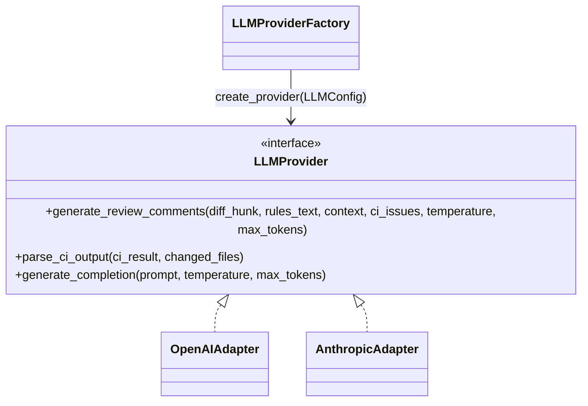
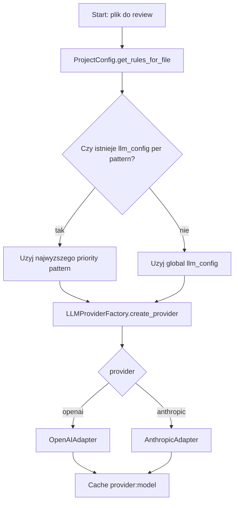
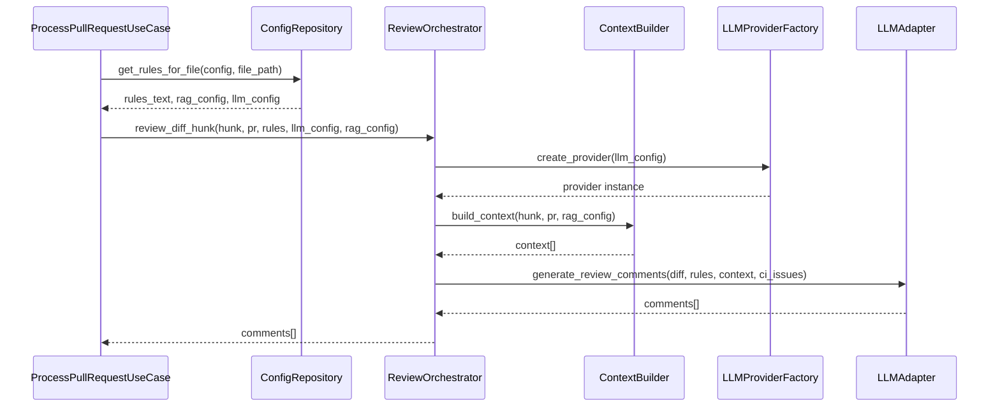
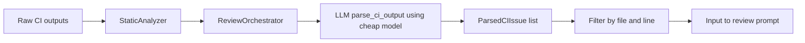

# Projekt modulu AI (wybor modelu, orkiestracja zapytan)

## 1. Cel podrozdzialu

Celem podrozdzialu jest przedstawienie projektu modulu AI systemu ACR, ze szczegolnym naciskiem na:

- mechanizm wyboru modelu LLM,
- orkiestracje zapytan dla review kodu,
- separacje odpowiedzialnosci miedzy warstwa aplikacji, domeny i adapterami dostawcow LLM.

Podrozdzial opisuje implementacje rzeczywiscie obecna w kodzie, a nie model docelowy abstrakcyjny.

## 2. Rola modulu AI w architekturze systemu

Modul AI stanowi warstwe wykonawcza dla decyzji review i dziala jako polaczenie:

1. kontraktu domenowego LLMProvider,
2. fabryki dostawcow LLMProviderFactory,
3. adapterow dostawcow (OpenAIAdapter, AnthropicAdapter),
4. orchestracji domenowej (ReviewOrchestrator + ContextBuilder),
5. wyboru konfiguracji per plik przez ProjectConfig i YAMLConfigLoader.

W praktyce modul realizuje dwa typy zadan:

- generowanie komentarzy code review,
- parsowanie wynikow CI do postaci ustrukturyzowanej.

## 3. Wymagania projektowe modulu AI

Modul powinien spelniac wymagania:

1. Provider-agnostic core: wspolny interfejs niezalezny od OpenAI/Anthropic.
2. Konfigurowalnosc wyboru modelu: globalnie i per pattern plikow.
3. Deterministyczna serializacja wyniku: JSON parseowalny do encji ReviewComment.
4. Integracja kontekstu: diff + RAG + surrounding code + CI issues.
5. Kontrola kosztu: osobny model do CI parsing i telemetry tokenow.
6. Odpornosc wykonania: fallbacki i filtracja odpowiedzi niepewnych.

## 4. Kontrakt domenowy i implementacje

Port LLMProvider definiuje trzy operacje:

- generate_review_comments(...),
- parse_ci_output(...),
- generate_completion(...).

Implementacje:

- OpenAIAdapter,
- AnthropicAdapter.

Diagram kontraktu:

## 5. Mechanizm wyboru modelu

## 5.1. Poziom konfiguracji

Wybor modelu jest realizowany przez konfiguracje wielopoziomowa:

1. konfiguracja globalna llm w .acr-config.yml,
2. nadpisanie per file pattern (file_patterns[].llm_config),
3. priorytety patternow (sortowanie malejaco po priority),
4. fallback do configu domyslnego, gdy brak pliku konfiguracyjnego.

Ta logika jest skupiona w:

- ProjectConfig.get_rules_for_file,
- YAMLConfigLoader._parse_config.

## 5.2. Poziom wykonawczy

ReviewOrchestrator otrzymuje llm_config dla konkretnego pliku i zleca fabryce utworzenie providera:

- LLMProviderFactory.create_provider(llm_config),
- cache providerow przez klucz provider:model,
- walidacja dostepnosci API key,
- utworzenie odpowiedniego adaptera.

## 5.3. Strategia kosztowa

Kazdy adapter posiada dwa profile modelu:

- model glowny do review (np. gpt-4o / claude-sonnet),
- model lzejszy do parse_ci_output (np. gpt-4o-mini / claude-haiku).

To rozdziela zadania wysokiej wartosci merytorycznej od zadan ekstrakcyjnych i ogranicza koszt tokenowy.

Diagram decyzji wyboru modelu:

## 6. Orkiestracja zapytan review

## 6.1. Przeplyw sterowania

Wykonanie review dla PR/MR przebiega wieloetapowo:

1. ProcessPullRequestUseCase dzieli review per plik.
2. Dla pliku pobierane sa rules_text, rag_config i llm_config.
3. Dla kazdego hunku uruchamiane jest review_orchestrator.review_diff_hunk.
4. ContextBuilder buduje kontekst (RAG + surrounding code).
5. Adapter LLM generuje komentarze na podstawie promptu i danych wejsciowych.
6. Wynik JSON jest mapowany na ReviewComment.

Wykonanie jest rownolegle:

- rownoleglosc per plik,
- rownoleglosc per hunk w pliku.

## 6.2. Wejscie modelu

Zapytanie review sklada sie z:

- diff hunk (obowiazkowo),
- rules_text (global + file-specific),
- context (ograniczony liczebnie; top context items),
- ci_issues (filtrowane do zmienionych plikow i linii).

## 6.3. Kontrakt odpowiedzi modelu

Adaptery wymagaja odpowiedzi w formacie JSON:

{
  "comments": [
    {
      "line": <line_number>,
      "severity": "error|warning|info",
      "message": "...",
      "suggestion": "..."
    }
  ]
}

Dalej wykonywane sa kroki post-processingu:

- ekstrakcja JSON z odpowiedzi tekstowej,
- normalizacja numerow linii do zakresu hunku,
- heurystyczne zakotwiczenie komentarzy definicyjnych,
- odrzucenie komentarzy spekulatywnych/niezweryfikowanych,
- mapowanie severity do value object Severity.

Diagram sekwencji dla pojedynczego hunku:

## 7. Orkiestracja zapytan CI parsing

## 7.1. Cel

Drugi tor zapytan AI sluzy do translacji heterogenicznych logow CI do jednolitej reprezentacji ParsedCIIssue.

## 7.2. Przeplyw

1. ReviewOrchestrator pobiera CI results przez StaticAnalyzer.
2. Dla kazdego wyniku uruchamia llm_provider.parse_ci_output(...).
3. Adapter uzywa modelu lzejszego (ci_parsing_model).
4. Wynik jest filtrowany do changed_files i zwracany jako lista ParsedCIIssue.
5. Issues sa nastepnie przypisywane do hunkow (file_path + line in hunk).

Diagram komponentowy:

## 8. Kontrola jakosci i bezpieczenstwo odpowiedzi

W module AI zastosowano jawne mechanizmy ograniczania halucynacji i szumu:

- instrukcje promptu wymuszajace evidence-based comments,
- hierarchia zrodel dowodowych (surrounding_code > diff > CI > PR history),
- zakaz komentarzy spekulatywnych,
- odrzucanie odpowiedzi niezgodnych z kontraktem JSON,
- filtrowanie linii poza zakresem analizowanego hunku.

To nie eliminuje ryzyka calkowicie, ale tworzy warstwe obronna przed czescia bledow systemowych LLM.

## 9. Telemetria i koszt inferencji

Factory i adaptery wspieraja UsageStats:

- zliczanie prompt_tokens i completion_tokens,
- fallback do estymacji tokenow, gdy provider nie zwraca usage,
- wykorzystanie metryk kosztowych w scenariuszach evaluate.

W efekcie modul AI jest przygotowany do analizy kompromisu jakosc-koszt.

## 10. Ograniczenia obecnej implementacji

1. Strategia wyboru modelu jest konfiguracyjna (statyczna per pattern), bez runtime routing wedlug ryzyka przypadku.
2. Prompt logic jest zdublowany miedzy adapterami OpenAI i Anthropic.
3. Brak dedykowanego komponentu model selector (decyzja jest rozproszona miedzy config i factory).
4. Jakosc wyniku nadal silnie zalezy od jakosci kontekstu wejsciowego.

## 11. Kierunki rozwoju modulu AI

Naturalne rozszerzenia:

- wydzielenie wspolnej warstwy prompt policy,
- dynamic routing modelu wg zlozonosci/ryzyka zmiany,
- quality gate po inferencji i warunkowa eskalacja do mocniejszego modelu,
- standaryzacja formatu odpowiedzi przez structured output APIs,
- lepsza kalibracja i A/B testing promptow.

## 12. Wniosek pod podrozdzial

Projekt modulu AI w systemie ACR opiera sie na stabilnym kontrakcie LLMProvider, konfigurowalnym wyborze modelu i wieloetapowej orkiestracji zapytan, ktora laczy dane ze zmian kodu, kontekst RAG i sygnaly CI. Aktualna implementacja dostarcza praktyczny, provider-agnostyczny rdzen review, jednoczesnie pozostawiajac przestrzen do dalszej adaptacji dynamicznego doboru modeli i formalnych mechanizmow quality gate.

## 13. Material zrodlowy wykorzystany do opracowania

- [acr_system/domain/interfaces/ports.py](acr_system/domain/interfaces/ports.py)
- [acr_system/domain/services/services.py](acr_system/domain/services/services.py)
- [acr_system/infrastructure/llm/llm_factory.py](acr_system/infrastructure/llm/llm_factory.py)
- [acr_system/infrastructure/llm/openai_adapter.py](acr_system/infrastructure/llm/openai_adapter.py)
- [acr_system/infrastructure/llm/anthropic_adapter.py](acr_system/infrastructure/llm/anthropic_adapter.py)
- [acr_system/infrastructure/config/project_config.py](acr_system/infrastructure/config/project_config.py)
- [acr_system/infrastructure/config/yaml_config_loader.py](acr_system/infrastructure/config/yaml_config_loader.py)
- [acr_system/application/use_cases/process_pull_request.py](acr_system/application/use_cases/process_pull_request.py)
- [README.md](README.md)
- [architektura-systemu.md](architektura-systemu.md)
