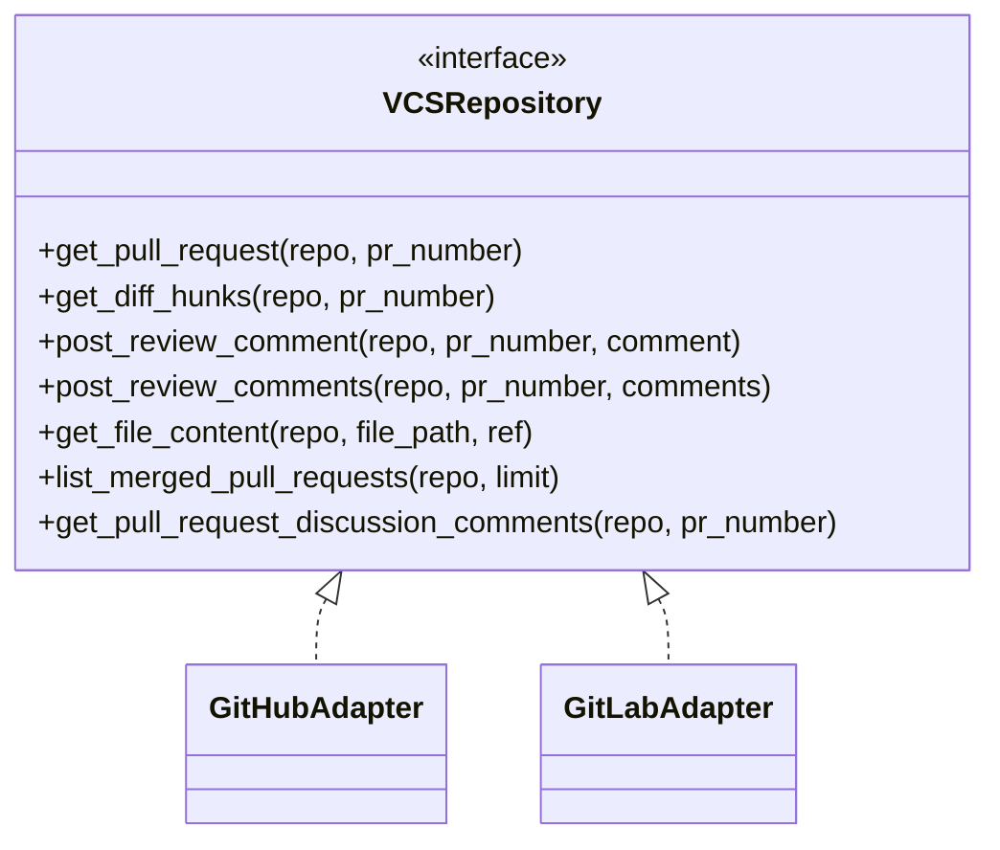
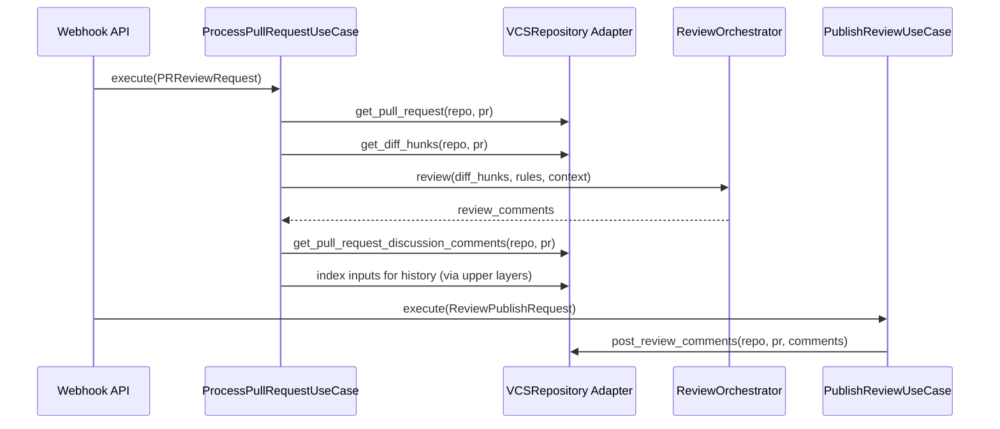
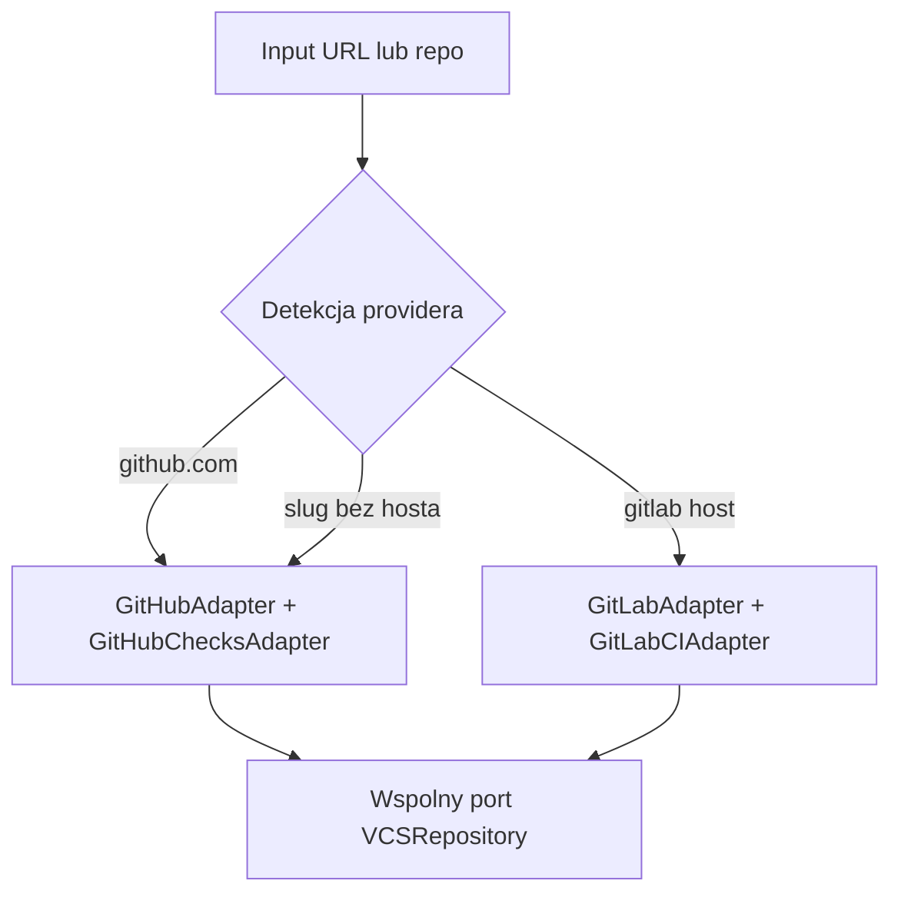

# Projekt modulu integracji z systemami kontroli wersji

## 1. Cel podrozdzialu

Celem podrozdzialu jest przedstawienie projektu modulu odpowiedzialnego za integracje systemu ACR z platformami kontroli wersji (VCS), w szczegolnosci GitHub i GitLab, w taki sposob, aby:

- pobierac dane PR/MR i zmiany kodu,
- publikowac komentarze review,
- pozyskiwac dyskusje historyczne do RAG,
- zachowac jednolity kontrakt domenowy niezaleznie od dostawcy API.

## 2. Rola modulu VCS w architekturze systemu

Modul VCS jest infrastrukturalna implementacja portu domenowego VCSRepository i stanowia go adaptery:

- GitHubAdapter,
- GitLabAdapter,
- komponent autoryzacyjny GitHubAppAuth (dla GitHub App).

Modul ten stanowi granice miedzy logika domenowa a zewnetrznymi API platform developerskich.

## 3. Wymagania projektowe modulu

Modul powinien spelniac wymagania:

1. Abstrakcja dostawcy: wspolny interfejs dla GitHub i GitLab.
2. Kompletna obsluga cyklu review: od pobrania PR/MR po publikacje komentarzy.
3. Obsluga kontekstu historycznego: dostep do komentarzy dyskusyjnych i review threads.
4. Bezpieczne uwierzytelnianie: tokeny instalacyjne, ograniczony czas zycia, cache.
5. Odpornosc integracyjna: fallbacki przy ograniczeniach API (np. brak mozliwosci inline).
6. Rozszerzalnosc: mozliwosc dolaczenia kolejnych dostawcow bez zmian domeny.

## 4. Kontrakt domenowy: port VCSRepository

Port VCSRepository definiuje operacje wymagane przez use-case'y i serwisy domenowe:

- get_pull_request,
- get_diff_hunks,
- post_review_comment,
- post_review_comments,
- get_file_content,
- list_merged_pull_requests,
- get_pull_request_discussion_comments.

To podejscie wymusza, aby adaptery dostawcow realizowaly ten sam zestaw zachowan przy roznych szczegolach protokolu API.

Diagram kontraktu i implementacji:

## 5. Implementacja integracji GitHub

## 5.1. Uwierzytelnianie

Integracja GitHub wykorzystuje GitHub App Authentication:

1. generowanie JWT na podstawie klucza prywatnego .pem,
2. pobranie installation access token,
3. cache tokenu z kontrola wygasania (odswiezanie przed terminem).

Projekt przewiduje rowniez fallback do token-based auth (Bearer), co upraszcza scenariusze eksperymentalne.

## 5.2. Pobieranie danych PR

Adapter pobiera:

- metadane PR (tytul, autor, galezie, head SHA),
- liste plikow i patch,
- szczegoly dyskusji (review comments + issue comments).

Patch jest parsowany do DiffHunk (naglowki @@ ... @@) i mapowany do encji domenowych.

## 5.3. Publikacja komentarzy

Strategia publikacji:

- komentarze line-specific trafiaja do pulls/{pr}/comments,
- komentarze ogolne trafiaja do issues/{pr}/comments,
- przy bledzie 422 dla komentarza inline stosowany jest fallback do komentarza ogolnego.

To zmniejsza ryzyko utraty informacji przy problemach pozycjonowania linii.

## 6. Implementacja integracji GitLab

## 6.1. Uwierzytelnianie i adresowanie repo

Integracja GitLab korzysta z PRIVATE-TOKEN oraz API base URL (domyslnie gitlab.com/api/v4). Repozytoria sa kodowane w formacie wymaganym przez endpoint projects/:id.

## 6.2. Pobieranie MR i zmian

Adapter pobiera:

- metadane MR,
- diff refs (head SHA),
- zmiany przez endpoint merge_requests/{iid}/changes,
- dyskusje przez merge_requests/{iid}/discussions.

## 6.3. Publikacja komentarzy i kompromis MVP

W obecnej implementacji komentarze sa publikowane jako MR notes. Pelne inline discussions z payloadem position nie sa jeszcze warstwa domyslna.

Konsekwencja: zachowana jest funkcjonalnosc komunikacji review, ale z mniejsza precyzja osadzenia w diffie wzgledem GitHub.

## 7. Przeplyw danych w module VCS

Diagram sekwencji (scenariusz API -> review -> publikacja):

## 8. Miejsca uzycia modulu VCS w systemie

Modul VCS jest wykorzystywany w dwoch glowych sciezkach runtime:

1. Webhook API:
   - trigger na pull_request opened/synchronize (GitHub),
   - uruchomienie background task i pelnego review flow.
2. CLI:
   - review dla pojedynczego PR/MR,
   - index-history dla merged PR/MR,
   - evaluate dla scenariuszy eksperymentalnych.

Diagram wyboru providera w CLI:

## 9. Model odpowiedzialnosci i separacja logiki

Rozdzielenie odpowiedzialnosci:

- adaptery VCS odpowiadaja za translacje API <-> encje domenowe,
- use-case'y odpowiadaja za kolejnosc operacji,
- domena nie zna endpointow HTTP ani schematow vendor-specific.

Dzieki temu:

- testy domeny nie wymagaja dostepu do zewnetrznych API,
- wymiana adaptera jest lokalna,
- ryzyko propagacji zmian API dostawcy do domeny jest ograniczone.

## 10. Mechanizmy odpornosci i obsluga bledow

W module zastosowano:

- dedykowane wyjatki integracyjne (VCSAPIError),
- obsluge HTTPError i HTTPStatusError,
- fallback publikacji inline -> komentarz ogolny (GitHub),
- zwracanie czesciowych rezultatow przy paginacji i limitach,
- jawne zamykanie klientow HTTP (close/aclose).

## 11. Aspekty wydajnosciowe i operacyjne

Kluczowe decyzje operacyjne:

- AsyncClient z timeoutami,
- paginacja przy listowaniu merged PR/MR i komentarzy,
- redukcja wywolan przez cache tokenu instalacyjnego,
- wspolny kontrakt umozliwiajacy uruchamianie tych samych use-case'ow dla obu providerow.

## 12. Ograniczenia obecnej implementacji

1. Sciezka GitLab webhook jest opisana, ale nie ma pelnego analogicznego background flow jak GitHub.
2. Publikacja komentarzy GitLab jest oparta glownie o notes (bez pelnej pozycji inline).
3. Roznice semantyczne API (PR vs MR, comments vs discussions) wymagaja translacji i moga ograniczac idealna przenaszalnosc zachowan.

## 13. Kierunki rozwoju modulu

Najbardziej naturalne rozszerzenia:

- pelne inline comments dla GitLab (position payload),
- weryfikacja podpisu webhookow i twardsze polityki security,
- warstwa retry/backoff dla bledow transient,
- adaptery dla kolejnych systemow (np. Bitbucket) bez zmian portu domenowego.

## 14. Wniosek pod podrozdzial

Projekt modulu integracji z systemami kontroli wersji opiera sie na stabilnym porcie domenowym VCSRepository oraz adapterach dostawcow, co pozwala laczyc heterogeniczne API GitHub i GitLab z jednolitym przeplywem review. Rozwiazanie zapewnia praktyczna obsluge pelnego cyklu PR/MR, a jednoczesnie utrzymuje separacje odpowiedzialnosci i gotowosc do dalszej ewolucji integracji.

## 15. Material zrodlowy wykorzystany do opracowania

- [acr_system/domain/interfaces/ports.py](acr_system/domain/interfaces/ports.py)
- [acr_system/infrastructure/vcs/github_adapter.py](acr_system/infrastructure/vcs/github_adapter.py)
- [acr_system/infrastructure/vcs/gitlab_adapter.py](acr_system/infrastructure/vcs/gitlab_adapter.py)
- [acr_system/infrastructure/auth/github_jwt.py](acr_system/infrastructure/auth/github_jwt.py)
- [acr_system/presentation/api/webhook_handlers.py](acr_system/presentation/api/webhook_handlers.py)
- [acr_system/presentation/cli/main.py](acr_system/presentation/cli/main.py)
- [acr_system/application/use_cases/process_pull_request.py](acr_system/application/use_cases/process_pull_request.py)
- [acr_system/application/use_cases/publish_review.py](acr_system/application/use_cases/publish_review.py)
- [acr_system/application/use_cases/index_pr_history.py](acr_system/application/use_cases/index_pr_history.py)
- [README.md](README.md)
- [architektura-systemu.md](architektura-systemu.md)
