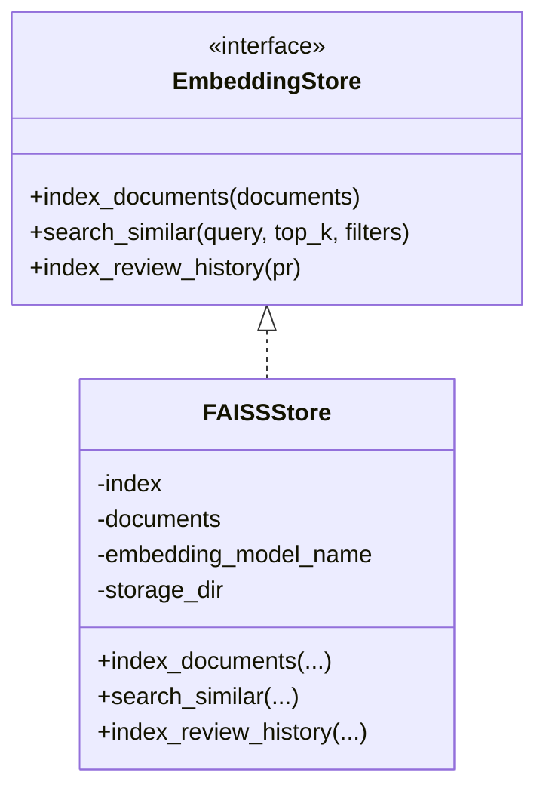
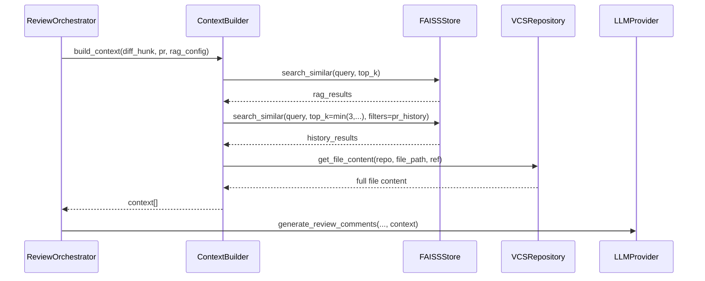
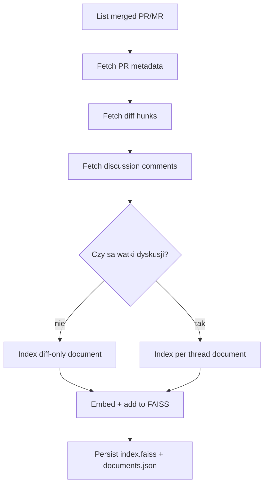

# Projekt warstwy RAG (repozytorium wiedzy, embeddingi, pipeline)

## 1. Cel podrozdzialu

Celem podrozdzialu jest przedstawienie projektu warstwy RAG w systemie ACR jako podsystemu odpowiedzialnego za:

- budowe i utrzymanie repozytorium wiedzy,
- generowanie i przechowywanie embeddingow,
- retrieval kontekstu do zapytan review,
- pipeline indeksacji historii PR/MR i dyskusji recenzenckich.

Opis dotyczy implementacji rzeczywiscie obecnej w kodzie projektu.

## 2. Rola warstwy RAG w architekturze ACR

Warstwa RAG jest osadzona miedzy domenowa orkiestracja review a zrodlami wiedzy projektowej.

Jej glowna funkcja to dostarczenie kontekstu, ktory uzupelnia diff i ogranicza ryzyko ogolnikowych lub nietrafnych komentarzy LLM.

W praktyce warstwa dziala w dwoch trybach:

1. online retrieval podczas review,
2. offline/inkrementalna indeksacja wiedzy historycznej.

## 3. Kontrakt domenowy i implementacja

Port domenowy EmbeddingStore definiuje trzy operacje:

- index_documents(documents),
- search_similar(query, top_k, filters),
- index_review_history(pr).

Aktualna implementacja portu:

- FAISSStore (infrastructure/rag/faiss_store.py).

Diagram kontraktu:

## 4. Repozytorium wiedzy: model danych i zrodla

## 4.1. Struktura logiczna wiedzy

Repozytorium wiedzy ma charakter hybrydowy:

- wektory i ANN index w FAISS,
- metadane dokumentow w pliku JSON (documents.json).

Kazdy rekord wiedzy zawiera co najmniej:

- content,
- source,
- metadane identyfikacyjne (repo, pr_number, comment_id, file_path, line_number, unique_key).

## 4.2. Klasy zrodel wiedzy

W aktualnym pipeline wykorzystywane sa m.in.:

- dokumentacja (source=documentation),
- historia PR diff-only (source=pr_history_diff),
- watki dyskusji recenzenckiej (source=pr_history_comment_thread),
- kontekst otaczajacego kodu (source=surrounding_code; dostarczany runtime, niekoniecznie trwale skladowany jako osobny dokument w store).

## 4.3. Mechanizm unikalnosci i deduplikacji

Dla wpisow historycznych stosowany jest unique_key:

- format: repo::pr:<nr>::<kind>:<identifier>,
- deduplikacja watkow i diff-only fallback,
- kompatybilnosc wsteczna dla starszych metadanych bez unique_key.

## 5. Embeddingi i warstwa storage

## 5.1. Model embeddingowy

Domyslny model embeddingow:

- sentence-transformers/all-MiniLM-L6-v2.

Ladowanie modelu jest lazy (na pierwsze uzycie), a wymiar embeddingu aktualizowany dynamicznie po inicjalizacji modelu.

## 5.2. Struktury przechowywania

- index.faiss: indeks wektorowy,
- documents.json: metadane i tresci dokumentow,
- konfiguracja sciezki przez RAG_FAISS_INDEX_PATH.

## 5.3. Inicjalizacja i odtwarzanie stanu

FAISSStore przy starcie probuje:

1. wczytac index i metadata,
2. zweryfikowac spojnosc liczby wektorow i rekordow,
3. ostrzec o roznym modelu embeddingowym,
4. przejsc do stanu pustego przy niespojnosci.

To minimalizuje ryzyko dzialania na uszkodzonym indeksie.

## 5.4. Telemetria embeddingow

Warstwa prowadzi lekka telemetrie:

- embedding_tokens,
- embedding_texts.

Metryki sa wykorzystywane w scenariuszach ewaluacyjnych kosztu pipeline.

## 6. Retrieval pipeline (online)

## 6.1. Budowa zapytania retrieval

ContextBuilder buduje query z danych hunku:

- file path,
- jezyk,
- pierwsze dodane linie diff (+).

To zapewnia query semantycznie zwiazane ze zmiana kodu.

## 6.2. Pobieranie kontekstu

Dla hunku pipeline pobiera:

1. klasyczne wyniki RAG (top_k),
2. podobne historyczne PR change/discussion (filtr source=pr_history, exclude_pr_number),
3. surrounding code z repo (okno linii, domyslnie sterowane RAG_SURROUNDING_LINES).

## 6.3. Ranking i filtracja

Mechanizmy obecne w search_similar:

- ANN search z over-fetch (requested_k * 5),
- filtracja po source i metadanych,
- wykluczenie biezacego PR history,
- konwersja odleglosci L2 -> relevance_score = 1/(1+d).

## 6.4. Integracja z orkiestracja review

Zbudowany context jest przekazywany do generate_review_comments jako integralna czesc promptu review.

Diagram sekwencji (online retrieval):

## 7. Indeksacja historii PR/MR (offline/inkrementalna)

## 7.1. Use case indeksacji

IndexPRHistoryUseCase realizuje pipeline:

1. listowanie merged PR/MR,
2. pobranie PR metadata,
3. pobranie diff_hunks,
4. pobranie discussion comments,
5. index_review_history(pr).

Wykonanie jest wspolbiezne z ograniczeniem semaphore=5 (ochrona przed throttlingiem API).

## 7.2. Strategia indeksowania historii

FAISSStore.index_review_history stosuje dwa scenariusze:

1. PR bez dyskusji:
   - jeden dokument diff-only.
2. PR z dyskusja:
   - osobny dokument na kazdy root thread + replies,
   - dolaczenie best-effort diff context dla lokalizacji komentarza.

## 7.3. Truncation i bezpieczenstwo rozmiaru

Dlugie tresci sa obcinane przed embeddingiem (np. 20k/25k znakow) przez _truncate_for_embedding, co ogranicza ryzyko nadmiernych kosztow i przeciazenia.

Diagram pipeline indeksacji:

## 8. Konfiguracja warstwy RAG

Kluczowe parametry z .acr-config.yml i env:

- rag.enabled,
- rag.top_k,
- rag.documentation_paths,
- rag.architectural_docs,
- RAG_EMBEDDING_MODEL,
- RAG_FAISS_INDEX_PATH,
- RAG_SURROUNDING_LINES.

Konfiguracja moze byc nadpisywana per file pattern (file_patterns[].rag_config), co pozwala dostosowac retrieval do typu pliku lub obszaru domeny.

## 9. Integracja runtime (API i CLI)

Warstwa RAG jest inicjalizowana zarowno w:

- webhook flow API,
- komendach CLI review/index-history/evaluate.

To oznacza jeden, spojny mechanizm retrieval i indeksacji niezaleznie od punktu wejscia systemu.

## 10. Cechy jakosciowe projektu RAG

Warstwa wspiera:

- rozszerzalnosc: port EmbeddingStore umozliwia podmiane backendu,
- trwalosc: persistent index + metadata,
- odtwarzalnosc: deterministiczne metadane i unique_key,
- efektywnosc: ANN search + over-fetch + filtry,
- odpornosc: best-effort fallback i logowanie ostrzezen zamiast hard-fail.

## 11. Ograniczenia aktualnej implementacji

1. Jeden backend wektorowy (FAISS); brak natywnej replikacji i shardingu.
2. Ranking oparty o prosty similarity z L2; brak rerankera semantycznego drugiego etapu.
3. Brak dedykowanego harmonogramu reindeksacji i polityki stale-data governance.
4. Wysoka jakosc retrieval zalezy od jakosci i aktualnosci zrodel wejscowych.

## 12. Kierunki rozwoju

Naturalne kierunki ewolucji:

- hybrydowe retrieval (wektorowe + leksykalne),
- warstwa rerankingu kontekstow,
- score calibration i quality gate dla context bundle,
- polityki retencji/wygaszania starych wpisow,
- rozszerzenie na zewnetrzne vector DB w scenariuszach skalowania.

## 13. Wniosek pod podrozdzial

Projekt warstwy RAG w systemie ACR realizuje praktyczny, trwaly i zintegrowany pipeline kontekstowy: od indeksacji wiedzy projektowej i historii PR po retrieval czasu rzeczywistego dla konkretnego hunku zmian. Obecna implementacja zapewnia solidna baze pod review wspierane LLM, jednoczesnie pozostawiajac jasna sciezke dalszego rozwoju w obszarze rankingow, governance danych i skalowania backendu wiedzy.

## 14. Material zrodlowy wykorzystany do opracowania

- [acr_system/domain/interfaces/ports.py](acr_system/domain/interfaces/ports.py)
- [acr_system/domain/services/services.py](acr_system/domain/services/services.py)
- [acr_system/domain/value_objects/value_objects.py](acr_system/domain/value_objects/value_objects.py)
- [acr_system/infrastructure/rag/faiss_store.py](acr_system/infrastructure/rag/faiss_store.py)
- [acr_system/infrastructure/config/project_config.py](acr_system/infrastructure/config/project_config.py)
- [acr_system/application/use_cases/index_pr_history.py](acr_system/application/use_cases/index_pr_history.py)
- [acr_system/application/use_cases/process_pull_request.py](acr_system/application/use_cases/process_pull_request.py)
- [acr_system/presentation/cli/main.py](acr_system/presentation/cli/main.py)
- [acr_system/presentation/api/webhook_handlers.py](acr_system/presentation/api/webhook_handlers.py)
- [README.md](README.md)
- [architektura-systemu.md](architektura-systemu.md)
