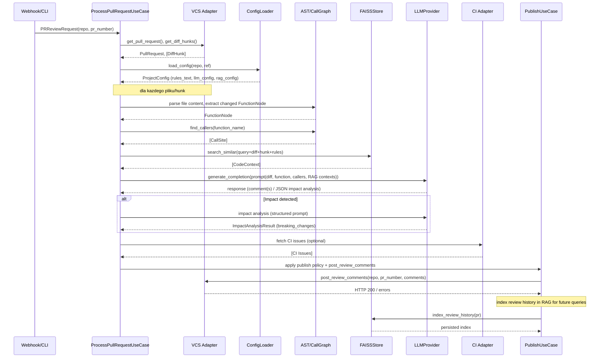

# Przepływ danych i przetwarzanie w systemie ACR

## 1. Cel i podejście

Celem tego dokumentu jest szczegółowy opis przepływu danych w systemie ACR: skąd pochodzą konkretne dane, w jakich miejscach i warstwach są przetwarzane, jakie transformacje są wykonywane oraz gdzie i w jakim formacie dane są ostatecznie wykorzystywane lub przechowywane.

Opis jest oparty na implementacji znajdującej się w repozytorium (odwołania do plików źródłowych poniżej). Diagramy Mermaid ilustrują główne ścieżki przetwarzania oraz szczegółowy przebieg dla pojedynczego PR.

---

## 2. Główne źródła i typy danych

- Zdarzenia VCS (GitHub webhook / GitLab webhook)
  - Plik: [acr_system/presentation/api/webhook_handlers.py](acr_system/presentation/api/webhook_handlers.py)
  - Zawierają: typ zdarzenia (`pull_request` / `merge_request`), metadane PR (numer, autor, gałęzie), fragmenty diffów (pliki, patch), repozytorium.

- Żądania CLI (`acr review`, `acr index-history`)
  - Plik: [acr_system/presentation/cli/main.py](acr_system/presentation/cli/main.py)
  - Zawierają: URL PR, opcje publikacji, ścieżki konfiguracyjne, parametry indeksacji historii.

- Treść plików repozytorium (kod źródłowy)
  - Pobierane przez adapter VCS: [acr_system/infrastructure/vcs/github_adapter.py](acr_system/infrastructure/vcs/github_adapter.py)
  - Używane do parsowania AST, ekstrakcji kontekstu i analizy diffów.

- Konfiguracja projektu / polityki publikacji
  - Pliki: `.acr-config.yml` (na repo docelowym), loader: [acr_system/infrastructure/config/yaml_config_loader.py](acr_system/infrastructure/config/yaml_config_loader.py)
  - Zawierają: reguły review, konfigurację LLM i RAG, politykę publikacji komentarzy.

- Wyniki CI / statyczne analizatory
  - Adaptery CI: [acr_system/infrastructure/ci/github_checks_adapter.py](acr_system/infrastructure/ci/github_checks_adapter.py)
  - Zawierają: listę issue/warn/error zgłoszonych przez narzędzia CI (ruff, mypy, testy), formatowane na potrzeby orkiestracji review.

- Indeks RAG / historia review (FAISS)
  - Plik: [acr_system/infrastructure/rag/faiss_store.py](acr_system/infrastructure/rag/faiss_store.py)
  - Przechowuje wektorowe reprezentacje fragmentów dokumentacji, dyskusji PR i historii review; zwracane są konteksty podobne do zapytania.

- Wyniki LLM (kompletne odpowiedzi / sugestie)
  - Adaptery LLM: fabryka i adaptery w [acr_system/infrastructure/llm](acr_system/infrastructure/llm)
  - Zawierają: wygenerowane komentarze, JSONowe odpowiedzi (np. z Impact Analysis), propozycje napraw.

- Artefakty tymczasowe / logi / telemetryka
  - Lokalnie w pamięci podczas przetwarzania; logowane przez [acr_system/shared/logging/logger.py](acr_system/shared/logging/logger.py).

---

## 3. Etapy przetwarzania danych (end-to-end)

Poniżej opisano kolejne etapy przetwarzania, z wskazaniem modułów/plików odpowiedzialnych oraz przykładowymi typami danych na wejściu i wyjściu.

### 3.1. Ingress – przyjęcie zdarzenia i autoryzacja

- Wejście: webhook GitHub (`request.json()`), nagłówki (`X-GitHub-Event`), lub argument CLI (`--pr-url`).
- Obsługa: [acr_system/presentation/api/webhook_handlers.py](acr_system/presentation/api/webhook_handlers.py) oraz [acr_system/presentation/cli/main.py](acr_system/presentation/cli/main.py).
- Działania:
  - Parsowanie zdarzenia, wyciągnięcie numeru PR i repozytorium.
  - Walidacja podstawowa (np. event type) i enqueue przetwarzania w tle (`BackgroundTasks` lub bezpośrednie wywołanie `ProcessPullRequestUseCase`).
- Wyjście: utworzenie obiektu `PRReviewRequest` z `repository` i `pr_number` przekazanego dalej do use-case.

### 3.2. Pobranie danych repozytorium (VCS)

- Wejście: `PRReviewRequest` (repo, pr_number).
- Obsługa: `VCSRepository` adaptery, np. [acr_system/infrastructure/vcs/github_adapter.py](acr_system/infrastructure/vcs/github_adapter.py).
- Działania:
  - `get_pull_request()` → zwraca `PullRequest` (metadane: title, author, target/source branch, head SHA).
  - `get_diff_hunks()` → zwraca listę `DiffHunk` (plik, zakres linii, treść patcha).
  - `get_file_content(repo, file_path, ref)` → pobiera zawartość pliku na danym refie (do AST/analizy kontekstu).
- Wyjście: struktury `PullRequest`, lista `DiffHunk`, zawartości plików.

### 3.3. Wczytanie konfiguracji projektu

- Wejście: `PullRequest.target_branch` i `repository`.
- Obsługa: `ConfigRepository` implementacja `YAMLConfigLoader` lub `FileYAMLConfigLoader` ([acr_system/infrastructure/config/yaml_config_loader.py](acr_system/infrastructure/config/yaml_config_loader.py)).
- Działania:
  - Odnalezienie `.acr-config.yml` w repozytorium (z użyciem VCS adaptera),
  - Parsowanie YAML do `ProjectConfig`, ekstrakcja reguł dla poszczególnych plików, domyślnych ustawień LLM/RAG.
- Wyjście: `ProjectConfig` zawierający `rules_text`, `llm_config`, `rag_config`.

### 3.4. Budowa kontekstu / RAG retrieval

- Wejście: treść diffu/hunka, reguły i zapytanie generowane na potrzeby hunk-a.
- Obsługa: `ContextBuilder` ([acr_system/domain/services/services.py]) z użyciem `EmbeddingStore` (`FAISSStore`).
- Działania:
  - Zbudowanie zapytania kontekstowego (np. fragment diff + surrounding code + reguły),
  - Wywołanie `embedding_store.search_similar(query, top_k)` → otrzymanie listy `CodeContext` (content, source, relevance_score).
- Wyjście: lista kontekstów RAG, używana jako dodatkowy kontekst promptów LLM.

### 3.5. Statyczna analiza i ekstrakcja AST

- Wejście: zawartość plików (kod) oraz konkretne hunk-i.
- Obsługa: `TreeSitterAdapter` i `TreeSitterCallGraphAnalyzer` ([acr_system/ast/tree_sitter_adapter.py], [acr_system/infrastructure/analysis/tree_sitter_call_graph_analyzer.py]).
- Działania:
  - Parsowanie pliku do AST,
  - Ekstrakcja zmienionych funkcji/definicji (`FunctionNode`),
  - Znajdowanie potencjalnych call sites (`find_callers`) – używane w Impact Analysis.
- Wyjście: `FunctionNode` (name, body, lines), `CallSite` listy z kontekstem.

### 3.6. Orkiestracja LLM i generacja propozycji

- Wejście: hunk, reguły (rules_text), RAG contexts, AST-derived function body, CI issues
- Obsługa: `ReviewOrchestrator` i `LLMProviderFactory` (fabric of adapters under `acr_system/infrastructure/llm`), oraz `LLMImpactAnalyzer` dla analiz semantycznych.
- Działania:
  - Zbudowanie promptu (diff + surrounding code + RAG context + rules),
  - Wywołania LLM: `generate_completion(prompt, ...)` → otrzymanie tekstu/JSON z odpowiedzią,
  - Parsowanie odpowiedzi do `ReviewComment` lub `BreakingChange`.
- Wyjście: lista proponowanych komentarzy review (z severity, file_path, line_number, message).

### 3.7. Łączenie wyników i publikacja

- Wejście: skompilowane komentarze z LLM, wyniki CI, ewentualne reguły publikacji z config.
- Obsługa: `PublishReviewUseCase` ([acr_system/application/use_cases/publish_review.py]) oraz `GitHubAdapter.post_review_comments`.
- Działania:
  - Aplikacja polityki publikacji (filter_comments_for_publication),
  - Publikacja komentarzy jako inline review comments lub ogólne issue comments,
  - Zapewnienie commit_id (head SHA) dla poprawnego osadzenia komentarzy.
- Wyjście: faktycznie opublikowane komentarze w PR (GitHub/GitLab).

### 3.8. Indeksacja historii i trwałe przechowywanie kontekstów

- Wejście: obiekt `PullRequest` z dyskusją i diffem.
- Obsługa: `FAISSStore.index_review_history` ([acr_system/infrastructure/rag/faiss_store.py]).
- Działania:
  - Przygotowanie treści wątków dyskusji + kontekst diffu,
  - Truncation / normalization dla embeddingu,
  - Dodanie wektora do indeksu i zapis metadanych w `documents.json` oraz indeksu w `index.faiss`.
- Wyjście: zaktualizowany indeks RAG, pliki na dysku (faiss_index/index.faiss, faiss_index/documents.json).

---

## 4. Diagramy (Mermaid)

### 4.1. Diagram ogólny – end-to-end

```mermaid
flowchart LR
  subgraph VCS
    A[GitHub/GitLab Webhook] -->|PR event| B(Webhook Handler)
    CLI[acr CLI] -->|review command| B
  end

  B --> C{Enqueue / Direct call}
  C --> D[ProcessPullRequestUseCase]
  D --> E[VCS Adapter (get PR, diffs, file content)]
  D --> F[Config Loader (.acr-config.yml)]
  D --> G[ContextBuilder (RAG search)]
  G --> H[FAISSStore (RAG index)]
  D --> I[AST Parser / CallGraphAnalyzer]
  I --> J[Tree-sitter parsing + call sites]
  D --> K[ReviewOrchestrator]
  K --> L[LLM Providers (OpenAI / Anthropic)]
  K --> M[CI Adapter (GitHub Checks)]
  K --> N[LLM Impact Analyzer]
  N --> I
  K --> O[PublishReviewUseCase]
  O --> P[VCS Adapter (post comments)]
  P --> Q[PR Discussion on GitHub]
  G --> H
  H --> K
```

### 4.2. Diagram szczegółowy – przetwarzanie pojedynczego hunk-a (sekwencja)



---

## 5. Mapa danych – co, gdzie i jak (tabela skrócona)

- `PullRequest` (metadane PR)
  - Źródło: GitHub API
  - Przetwarzanie: pobierane w `GitHubAdapter.get_pull_request()`
  - Wykorzystanie: identyfikacja gałęzi, head SHA, publikacja komentarzy

- `DiffHunk`
  - Źródło: GitHub API (`pulls/{pr}/files` z polem `patch`)
  - Przetwarzanie: parsowane w `GitHubAdapter._parse_patch()` → analiza w `ProcessPullRequestUseCase`
  - Wykorzystanie: budowanie promptów, AST extraction, impact analysis

- `File content` (kod źródłowy)
  - Źródło: GitHub API (`contents` endpoint) lub lokalna kopia (dla `index-history`)
  - Przetwarzanie: AST parsing (`TreeSitterAdapter`), grep/validation (`TreeSitterCallGraphAnalyzer`)
  - Wykorzystanie: generowanie kontekstu do LLM, walidacja call sites

- `ProjectConfig` (.acr-config.yml)
  - Źródło: repo (VCS) – loader: `YAMLConfigLoader`
  - Przetwarzanie: mapowanie do reguł i profili LLM/RAG
  - Wykorzystanie: filtrowanie komentarzy do publikacji, per-file rules

- `RAG documents` / `FAISS index`
  - Źródło: dokumentacja repo, README, indexed PR history
  - Przetwarzanie: embeddingy w `FAISSStore._embed_text()` i indeksacja
  - Wykorzystanie: dostarczanie kontekstu przy budowie promptów LLM

- `LLM responses` (tekst / JSON)
  - Źródło: OpenAI / Anthropic adaptory
  - Przetwarzanie: parsowanie odpowiedzi (czasem JSON), normalizacja do `ReviewComment`/`BreakingChange`
  - Wykorzystanie: treść komentarzy review, sugestie naprawcze, ocena severity

---

## 6. Uwagi dotyczące prywatnych/sekretnych danych i operacji

- Klucze API / GitHub App private key są przechowywane poza repo (w `env`), konfigurowane przez `.env` / CI secrets (`GITHUB_APP_PRIVATE_KEY_PATH`, `OPENAI_API_KEY`, `ANTHROPIC_API_KEY`).
- Adaptery wykonują wywołania HTTP do zewnętrznych API; w logach należy dbać o maskowanie sekretów (implementacja loggera powinna tego pilnować).

---

## 7. Wskazówki do dalszej wizualizacji i weryfikacji

- Możliwe rozszerzenie diagramów o sekwencje czasu, czasy odpowiedzi LLM i wielkości payloadów.
- Dla E2E reproducibility: przygotować przykładowy, zanonimizowany webhook payload i przeprowadzić walkthrough krok-po-kroku uruchamiając `acr review --pr-url ...` lokalnie.

---

## 8. Materiały źródłowe (odwołania do implementacji)

- [acr_system/presentation/api/webhook_handlers.py](acr_system/presentation/api/webhook_handlers.py)
- [acr_system/presentation/cli/main.py](acr_system/presentation/cli/main.py)
- [acr_system/application/use_cases/process_pull_request.py](acr_system/application/use_cases/process_pull_request.py)
- [acr_system/infrastructure/vcs/github_adapter.py](acr_system/infrastructure/vcs/github_adapter.py)
- [acr_system/infrastructure/rag/faiss_store.py](acr_system/infrastructure/rag/faiss_store.py)
- [acr_system/infrastructure/analysis/tree_sitter_call_graph_analyzer.py](acr_system/infrastructure/analysis/tree_sitter_call_graph_analyzer.py)
- [acr_system/infrastructure/analysis/llm_impact_analyzer.py](acr_system/infrastructure/analysis/llm_impact_analyzer.py)
- [acr_system/infrastructure/config/yaml_config_loader.py](acr_system/infrastructure/config/yaml_config_loader.py)
- [acr_system/shared/logging/logger.py](acr_system/shared/logging/logger.py)


---

Plik gotowy — poniżej znajduje się rozszerzony, techniczny dodatek opisujący schematy danych, przykładowy (zanonimizowany) payload webhooku, JSON-schema odpowiedzi LLM, metadane FAISS, limity i zachowania retry/timeoutów stosowane w implementacji.

## 9. Szczegóły implementacyjne — schematy danych, payloady i limity

Poniższa sekcja ma charakter techniczny i przedstawia dokładne struktury danych oraz behawior kodu z perspektywy implementacyjnej.

### 9.1. Kluczowe DTO / encje (pola i typy)

- `PRReviewRequest` (`acr_system/application/dto/dto.py`)
  - `repository: str` — "owner/repo"
  - `pr_number: int`
  - `config_override: Optional[dict]`

- `PullRequest` (`acr_system/domain/entities/entities.py`)
  - `pr_number: int`, `repository: str`, `title: str`, `description: str`,
  - `author: str`, `source_branch: str`, `target_branch: str`,
  - `head_sha: Optional[str]` — wykorzystywane przy publikacji komentarzy,
  - `diff_hunks: List[DiffHunk]`, `ci_results: List[CIToolResult]`,
  - `discussion_comments: List[PullRequestDiscussionComment]` (pobrane z VCS),

- `DiffHunk` (`entities.py`)
  - `file_path: FilePath`, `old_start_line: int`, `old_line_count: int`,
  - `new_start_line: int`, `new_line_count: int`, `content: str` (patch), `id: UUID`,
  - `context_before/context_after: str` (wypełniane przez ekstrakcję kontekstu),

- `ReviewComment` (`entities.py`)
  - `file_path: FilePath`, `line_number: Optional[int]`, `severity: Severity`, `message: str`,
  - `source: CommentSource`, `suggestion: Optional[str]`, `rule_name: Optional[str]`, `id: UUID`, `created_at: datetime`

- `FunctionNode` (`entities.py`)
  - `name: str`, `file_path: FilePath`, `start_line: int`, `end_line: int`, `body: str`, `language: Language`, `signature: Optional[str]`

- `CallSite`, `ImportSite`, `ImpactAnalysisResult`, `BreakingChange` — (`domain/value_objects/value_objects.py`) — immutowalne lub kontrolowane obiekty wynikowe używane przez Impact Analysis.

Te klasy są podstawą formatu danych przepływających między warstwami: presentation → application → domain → infrastructure.

### 9.2. Przykładowy (zanonimizowany) GitHub webhook payload (skrót)

Przykład: zdarzenie `pull_request` (skrócony, zanonimizowany):

```json
{
  "action": "opened",
  "number": 123,
  "pull_request": {
    "number": 123,
    "title": "Fix memory leak in parser",
    "body": "...",
    "head": {"ref": "feature/mem-fix", "sha": "abcdef"},
    "base": {"ref": "main"},
    "user": {"login": "contributor"}
  },
  "repository": {"full_name": "owner/repo"}
}
```

W kodzie: `webhook_handlers.github_webhook()` odczytuje `payload["pull_request"]` i przekazuje `repository` + `pr_number` do `process_pr_review_task`.

### 9.3. Format promptu LLM i wymagana odpowiedź JSON (Impact Analysis)

`LLMImpactAnalyzer` buduje prompt o strukturze zobrazowanej w `acr_system/infrastructure/analysis/llm_impact_analyzer.py`.

Wymuszony format odpowiedzi (JSON):

```json
{
  "severity": "critical|high|medium|low",
  "breaking_changes": [
    {
      "caller_file": "path/to/file.py",
      "caller_function": "function_name",
      "issue": "Concise description of what can break",
      "suggested_fix": "Code suggestion or steps to fix",
      "severity": "critical|high|medium|low"
    }
  ],
  "summary": "Overall impact assessment"
}
```

Parsing tej odpowiedzi jest krytycznym krokiem: implementacja ręcznie parsuje JSON i tworzy `BreakingChange` obiekty; niepoprawne JSON-y są traktowane jako `AnalysisError`.

### 9.4. Metadane dokumentów FAISS (jak są zapisywane)

W `FAISSStore.index_review_history()` dokumenty dodawane są do `self.documents` jako słowniki z polami (przykładowo):

```json
{
  "filename": "PR-123-comment-456",
  "content": "...thread text + diff context...",
  "source": "pr_history_comment_thread|pr_history_diff|documentation",
  "repo": "owner/repo",
  "pr_number": "123",
  "comment_id": "456",
  "file_path": "src/module.py",
  "line_number": "42",
  "url": "https://github.com/...",
  "unique_key": "owner/repo:123:comment:456"
}
```

Plik `documents.json` przechowuje `embedding_model_name`, `dimension` i listę `documents` z powyższymi metadanymi; indeks FAISS zapisywany jest w `index.faiss`.

Domyślna lokalizacja: `./faiss_index/index.faiss` i `./faiss_index/documents.json` (można nadpisać przez `RAG_FAISS_INDEX_PATH`).

### 9.5. Polityka tokenów, truncation i limity promptów

- `FAISSStore._truncate_for_embedding(content, max_chars=20_000|25_000)` — przy indeksacji treść jest obcinana do bezpiecznej długości przed wywołaniem embeddingu (zob. `index_review_history`).
- `LLMConfig.max_tokens` domyślnie 2000 (możliwe nadpisanie w `ProjectConfig`).
- `FAISSStore` liczy przybliżoną liczbę tokenów przez `approx_token_count()` i prowadzi statystyki `self.stats["embedding_tokens"]`.
- Przy budowie promptu rekomendowana praktyka:
  - najpierw dołączyć patch/diff (skomprymowany),
  - dołączyć funkcję (jedna funkcja, pełne ciało),
  - dołączyć najważniejsze `top_k` konteksty RAG (z `relevance_score`),
  - control: całkowity rozmiar promptu < (LLM token limit - `max_tokens_response`).

### 9.6. RAG retrieval — filtry i wybór dokumentów

- `search_similar(query, top_k)` w `FAISSStore`:
  - wykonuje embedding zapytania,
  - wyszukuje ANN (faiss) z nadpobieraniem (`search_k = min(requested_k * 5, ntotal)`),
  - stosuje filtry metadanych (`source`, `pr_number`, inne),
  - przelicza odległość na score: `similarity = 1/(1+distance)` i zwraca `top_k` dopasowań,
  - to pozwala łączyć skalowalny ANN z precyzyjną polityką filtrowania.

### 9.7. Publikacja komentarzy — atomiczność i wymagania

- `GitHubAdapter.post_review_comments()`:
  - pobiera `PullRequest.head_sha` (konieczne do publikowania komentarzy inline),
  - dla każdej `ReviewComment` może wysłać komentarz inline (endpoint `pulls/{pr}/comments`) lub ogólny (`issues/{pr}/comments`),
  - implementuje fallback: jeżeli publikacja inline zwróci HTTP 422 (linia nie odnaleziona), publikuje comment jako ogólny z informacją o numerze linii.

### 9.8. Concurrency, timeouty i retry

- `ProcessPullRequestUseCase.execute()` uruchamia przetwarzanie plików i hunków równolegle przy pomocy `asyncio.gather()` — to naturalna równoległość oparta o liczbę `changed_files` i `hunk` tasków.
- `GitHubAdapter.client` jest `httpx.AsyncClient(timeout=30.0)` — timeout 30s dla pojedynczych żądań HTTP.
- Błędy HTTP są mapowane na `VCSAPIError`; `ProcessPullRequestUseCase` obsługuje wyjątki i kontynuuje przetwarzanie innych plików, logując problemy.
- Obecnie brak scentralizowanego backoff/retry na poziomie use-case; rekomendowane wzmacniania:
  - retry z wykładniczym backoff dla połączeń do LLM i VCS,
  - semafor ograniczający jednoczesne wywołania LLM (konfigurowalny),
  - circuit breaker dla providerów zewnętrznych.

### 9.9. Obsługa błędów i logowanie

- Każdy krytyczny etap (VCS fetch, parse AST, LLM call, publish) jest otoczony try/except i loguje szczegóły przez `get_logger()`.
- W `process_pr_review_task` błędy powodują zapis `logger.error(...)` i (zależnie od miejsca) zakończenie zadania; jednak wcześniej wygenerowane komentarze i indeksacje mogą pozostać wykonane — projekt świadomie preferuje dostępność nad pełną transakcyjnością.

### 9.10. Konfiguracja środowiskowa i zmienne istotne przy przepływie danych

- `GITHUB_APP_ID`, `GITHUB_APP_PRIVATE_KEY_PATH`, `GITHUB_APP_INSTALLATION_ID` — autoryzacja GitHub App (wymagane do odczytu PR i publikacji komentarzy).
- `OPENAI_API_KEY`, `ANTHROPIC_API_KEY` — klucze LLM providers.
- `RAG_EMBEDDING_MODEL` — nazwa modelu embeddingowego (domyślnie `sentence-transformers/all-MiniLM-L6-v2`).
- `RAG_FAISS_INDEX_PATH` — miejsce zapisu indeksu FAISS (domyślnie `./faiss_index`).

### 9.11. Diagram pomocniczy — przepływ z adnotacjami typów danych

```mermaid
flowchart LR
  Webhook[GitHub Webhook]\n  Webhook -->|JSON(payload)| WebhookHandler((`github_webhook()`))
  WebhookHandler -->|PRReviewRequest(repository:str, pr_number:int)| UseCase[ProcessPullRequestUseCase]
  UseCase -->|get_pull_request() -> PullRequest| VCS[GitHubAdapter]
  UseCase -->|get_diff_hunks() -> [DiffHunk]| VCS
  UseCase -->|load_config() -> ProjectConfig| Config[YAMLConfigLoader]
  UseCase -->|search_similar(query)-> [CodeContext]| RAG[FAISSStore]
  RAG -->|documents.json / index.faiss| Disk[(faiss_index/*)]
  UseCase -->|parse file -> FunctionNode| AST[TreeSitterAdapter]
  UseCase -->|find_callers() -> [CallSite]| CallGraph[TreeSitterCallGraphAnalyzer]
  UseCase -->|generate_completion(prompt)-> str/JSON| LLM[LLMProvider]
  LLM -->|response JSON -> BreakingChange[]| UseCase
  UseCase -->|post_review_comments(comments: [ReviewComment])| VCS
  VCS -->|PR discussion| GitHubUI[(GitHub PR)]
```

---

## 10. Zalecenia i kroki następne (implementacyjne)

1. Dodać centralny mechanizm retry/backoff dla wywołań HTTP i LLM z parametryzacją w `pyproject.toml`/`.env`.
2. Wprowadzić limiter jednoczesnych wywołań LLM (async semaphore) i metryki kosztu (tokens per PR).
3. Ujednolicić format JSON odpowiedzi LLM i dodać walidator schematu (pydantic) przed konwersją do `BreakingChange`.
4. Rozszerzyć testy integracyjne o scenariusze błędne (LLM zwraca nie-JSON, VCS timeout, brak head_sha).
5. Dodać opcjonalny tryb transakcyjny publikacji (agregowanie i atomiczne wysyłanie komentarzy) dla krytycznych repozytoriów.

---

Plik zaktualizowany — jeżeli chcesz, mogę teraz:

- dodać walidator pydantic dla `BreakingChange` i `ImpactAnalysisResult` oraz przykładowe testy parsowania odpowiedzi LLM,
- wygenerować szczegółowy walkthrough na podstawie konkretnego przykładowego PR (anonimizacja) i zrzuty ekranu/sekcji z `htmlcov`/logów,
- skrócić lub rozszerzyć tę sekcję zgodnie z wymaganiami promotora (np. usunąć opis ogólny i zostawić tylko szczegóły techniczne).

