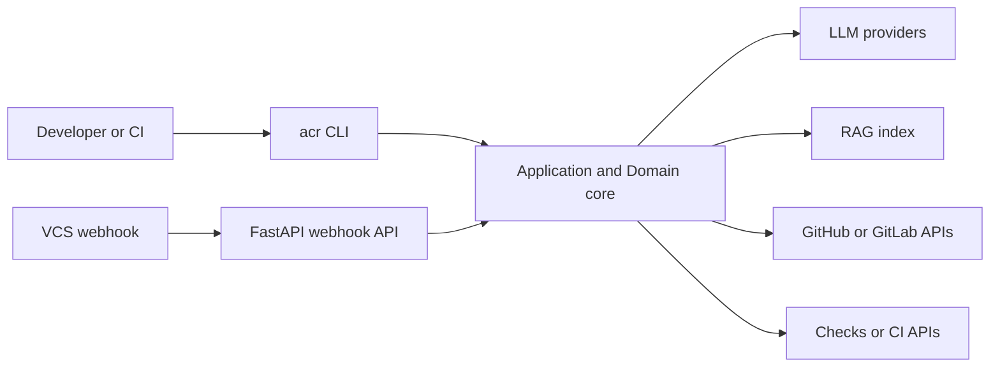

# Srodowisko technologiczne i narzedzia

## 1. Cel podrozdzialu

Celem podrozdzialu jest opisanie srodowiska technologicznego i zestawu narzedzi wykorzystanych do implementacji systemu ACR, ze wskazaniem:

- technologii runtime,
- technologii integracyjnych,
- narzedzi developerskich i testowych,
- praktyk uruchamiania, konfiguracji i kontroli jakosci.

Opis opiera sie na plikach konfiguracyjnych i skryptach obecnych w repozytorium.

## 2. Kontekst implementacyjny

System ACR jest implementowany jako aplikacja Python oparta o architekture warstwowa (domain, application, infrastructure, presentation) i udostepnia dwa glowne tryby pracy:

1. tryb serwerowy (API webhook),
2. tryb wsadowy/manualny (CLI).

To podejscie pozwala jednoczesnie integrowac sie z workflow PR/MR i wykonywac analizy eksperymentalne lokalnie.

## 3. Platforma bazowa i runtime

## 3.1. Jezyk i wersja

- Python >= 3.11

Uzasadnienie implementacyjne:

- dojrzaly ekosystem bibliotek async,
- szerokie wsparcie dla integracji LLM, RAG i API,
- dobra kompatybilnosc z narzedziami statycznej kontroli jakosci.

## 3.2. Pakowanie i instalacja

Projekt korzysta z:

- setuptools + wheel (build backend),
- instalacji editable (`pip install -e .`),
- grup optional dependencies (`dev`, `llm`, `rag`, `ast`, `all`).

To umozwia rozdzielenie minimalnego runtime od pelnego srodowiska developerskiego.

## 3.3. Punkty uruchomienia

- API: FastAPI + Uvicorn,
- CLI: skrypt `acr` mapowany przez `[project.scripts]`.

Diagram runtime:

## 4. Technologie warstwy aplikacyjnej i integracyjnej

## 4.1. API i komunikacja

- FastAPI: REST endpoints i webhook handlers,
- Uvicorn: serwer ASGI,
- httpx: asynchroniczna komunikacja HTTP z API zewnetrznymi.

## 4.2. Konfiguracja i serializacja

- PyYAML: parsowanie `.acr-config.yml`,
- pydantic + pydantic-settings + pydantic-yaml: walidacja i zarzadzanie konfiguracja,
- python-dotenv: ladowanie zmiennych srodowiskowych.

## 4.3. Uwierzytelnianie i bezpieczenstwo integracji

- PyJWT[crypto]: GitHub App JWT auth,
- tokeny instalacyjne GitHub z auto-refresh,
- wsparcie dla tokenow GitLab i tokenow personalnych (scenariusze developerskie).

## 5. Technologie AI, RAG i analiza kodu

## 5.1. LLM

- openai (adapter OpenAI),
- anthropic (adapter Anthropic).

W implementacji istnieje fabryka providerow i konfiguracja per repo/per plik.

## 5.2. RAG i embeddingi

- faiss-cpu: indeks wektorowy,
- sentence-transformers: embeddingi,
- rank-bm25: komponent pomocniczy dla rozszerzalnosci retrieval.

## 5.3. Analiza AST

- tree-sitter: parsowanie kodu i ekstrakcja struktur (funkcje, klasy, importy).

## 6. Narzedzia developerskie i workflow

## 6.1. Zarzadzanie poleceniami developerskimi

Repozytorium zawiera Makefile z celami:

- instalacja (`install`, `install-dev`),
- testy (`test`, `test-cov`, `test-unit`, `test-integration`),
- jakosc (`lint`, `format`, `type-check`, `quality`),
- uruchamianie (`run-api`, `run-cli-help`),
- CI lokalne (`ci`).

To unifikuje workflow zespolu i zmniejsza liczbe manualnych krokow.

## 6.2. Formatowanie, linting, typowanie

- black: formatowanie,
- ruff: linting,
- mypy (strict): statyczna kontrola typow,
- pre-commit: automatyzacja hakow jakosciowych.

Konfiguracja narzedzi jest utrzymywana w `pyproject.toml`, co upraszcza reprodukowalnosc.

## 6.3. Testowanie

- pytest,
- pytest-asyncio,
- pytest-cov,
- pytest-mock.

Konfiguracja testow obejmuje raportowanie pokrycia do terminala, HTML i XML.

## 6.4. Tworzenie kodu w VS Code

W praktyce implementacja kodu byla realizowana w srodowisku VS Code jako glownym IDE projektu.

Kluczowe elementy pracy developerskiej w VS Code:

- edycja kodu warstwowego (domain/application/infrastructure/presentation) w jednej przestrzeni roboczej,
- uruchamianie API i komend CLI z terminala zintegrowanego,
- szybka iteracja kod -> uruchomienie -> poprawka,
- integracja z narzedziami jakosci (`ruff`, `black`, `mypy`, `pytest`) uruchamianymi lokalnie,
- wygodna praca na plikach konfiguracyjnych (`.env`, `.acr-config.yml`, `pyproject.toml`, `Makefile`).

Z punktu widzenia implementacji rozwiazania, VS Code pelni role centralnego srodowiska developerskiego, w ktorym laczone sa prace kodowe, konfiguracyjne i testowe.

## 6.5. Testowanie manualne w Postman

Poza testami automatycznymi zastosowano testowanie manualne API z wykorzystaniem Postmana.

Zakres testow manualnych obejmuje w szczegolnosci:

- weryfikacje dostepnosci endpointow (`/`, `/health`, webhooki),
- walidacje poprawnosci odpowiedzi HTTP i kodow statusu,
- testy poprawnosci payloadow webhookow,
- testy scenariuszy blednych (braki danych, niepoprawny format),
- szybkie testy regresyjne po zmianach w warstwie API i integracji VCS.

Testowanie w Postmanie uzupelnia testy automatyczne o warstwe weryfikacji manualnej zachowania interfejsu HTTP w warunkach zblizonych do rzeczywistej integracji.

## 6.6. GitHub jako srodowisko kontroli wersji

Projekt systemu ACR jest utrzymywany w repozytorium GitHub, ktore stanowi podstawowe srodowisko kontroli wersji.

W praktyce obejmuje to:

- wersjonowanie kodu z historia zmian i kontrola rewizji,
- zarzadzanie galeziami i integracje zmian,
- uruchamianie procesu review ACR na zdarzeniach PR przez webhook API.

Takie osadzenie projektu i procesu review w GitHubie pozwala realizowac implementacje, review i integracje zmian w jednym, spojnym srodowisku pracy.

## 7. Konfiguracja srodowiska uruchomieniowego

## 7.1. Zmienne srodowiskowe

Plik `.env.example` definiuje parametry m.in. dla:

- providerow LLM,
- autoryzacji GitHub/GitLab,
- hosta i portu API,
- parametrow RAG,
- domyslnych parametrow modelu.

## 7.2. Konfiguracja per repozytorium

Poza `.env` system wykorzystuje `.acr-config.yml` w repozytorium docelowym do sterowania:

- zasadami review,
- konfiguracja LLM i RAG,
- polityka publikacji komentarzy.

To rozdziela konfiguracje srodowiskowa od polityk review.

## 8. Srodowisko implementacyjne: tryby pracy

## 8.1. Tryb developerski

Typowy scenariusz:

1. utworzenie venv,
2. instalacja `.[all]`,
3. konfiguracja `.env`,
4. uruchomienie API lub CLI,
5. lokalne quality gates przez `make quality` lub `pre-commit`.

## 8.2. Tryb integracyjny

Webhook API odbiera zdarzenia VCS, uruchamia review i publikuje komentarze. Ten tryb wymaga poprawnej konfiguracji kluczy i sekretow integracyjnych.

## 8.3. Tryb eksperymentalny

CLI udostepnia komendy indeksacji historii i ewaluacji (`index-history`, `evaluate`) z mozliwoscia lokalnej konfiguracji przez dedykowany loader plikowy.

## 9. Kryteria wyboru narzedzi

Dobor technologii i narzedzi byl podporzadkowany nastepujacym kryteriom:

1. kompatybilnosc z architektura heksagonalna,
2. wsparcie dla asynchronicznych integracji API,
3. dojrzalosc bibliotek dla LLM i RAG,
4. niski koszt utrzymania i prostota wdrozenia lokalnego,
5. mozliwosc scislej kontroli jakosci kodu i testow.

## 10. Ograniczenia i konsekwencje praktyczne

1. Srodowisko opiera sie na konfiguracji sekretow zewnetrznych, co wymaga rygoru operacyjnego.
2. Integracje AI i VCS sa wrazliwe na limity API i zmiennosc odpowiedzi dostawcow.
3. Czesci funkcjonalnosci (np. pelne scenariusze provider-specific) moga miec odmienna dojrzalosc w zaleznosci od adaptera.
4. Lokalna reprodukcja pelnego stacku wymaga instalacji opcjonalnych zaleznosci (`.[all]`).

## 11. Wniosek pod podrozdzial

Srodowisko technologiczne i narzedzia implementacyjne systemu ACR tworza spojny, praktyczny stos dla budowy i utrzymania rozwiazania AI-assisted code review. Python 3.11+, FastAPI, Click, httpx, biblioteki LLM, FAISS, tree-sitter oraz zestaw narzedzi quality engineering (pytest, black, ruff, mypy, pre-commit), uzupelnione o praktyke tworzenia kodu w VS Code, testowanie manualne API w Postmanie oraz utrzymanie projektu w repozytorium GitHub, zapewniaja rownowage miedzy szybkoscia rozwoju, kontrola jakosci i gotowoscia integracyjna z rzeczywistym workflow PR/MR.

## 12. Material zrodlowy wykorzystany do opracowania

- [README.md](README.md)
- [pyproject.toml](pyproject.toml)
- [Makefile](Makefile)
- [CONTRIBUTING.md](CONTRIBUTING.md)
- [.env.example](.env.example)
- [acr_system/presentation/api/main.py](acr_system/presentation/api/main.py)
- [acr_system/presentation/api/webhook_handlers.py](acr_system/presentation/api/webhook_handlers.py)
- [acr_system/presentation/cli/main.py](acr_system/presentation/cli/main.py)
- [acr_system/infrastructure/auth/README.md](acr_system/infrastructure/auth/README.md)
